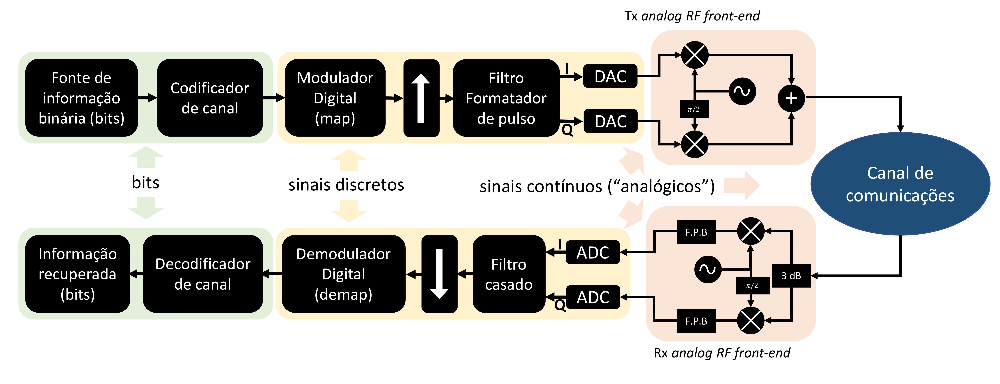
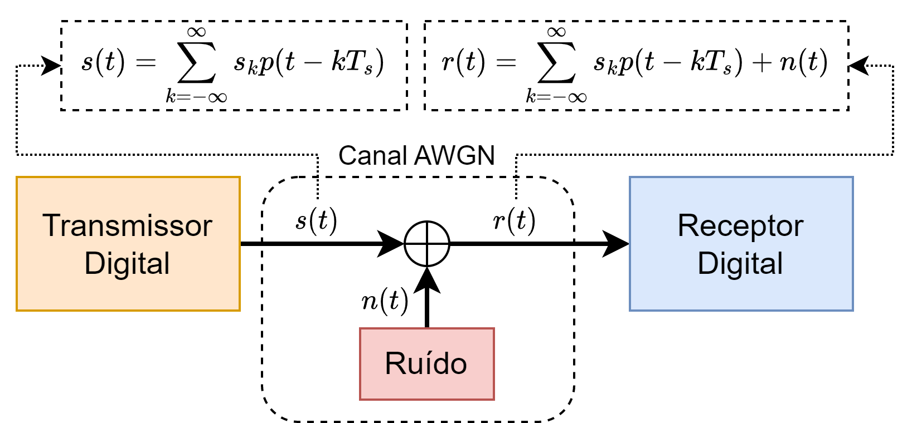
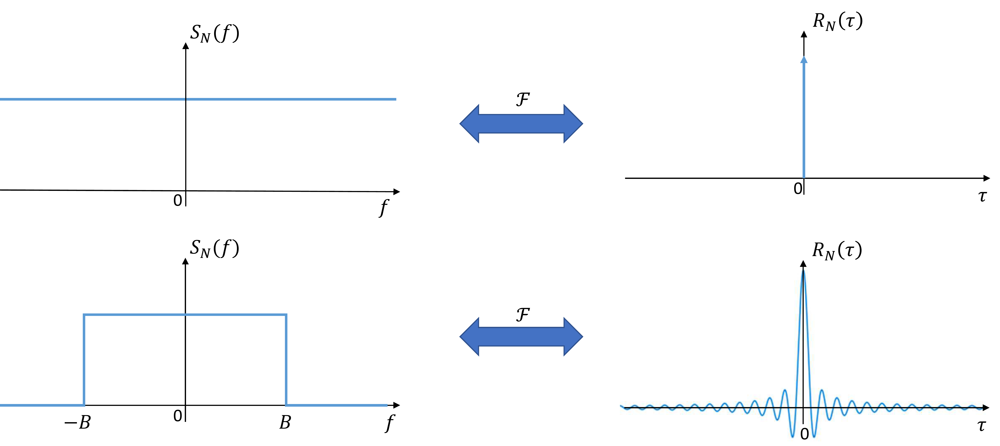
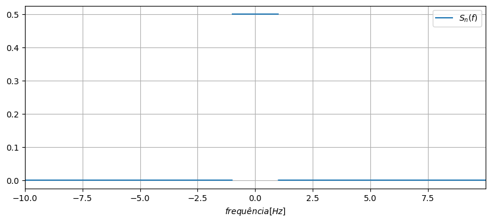
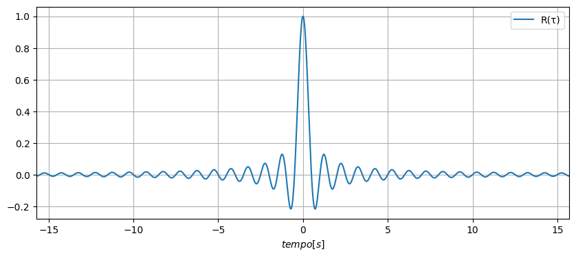
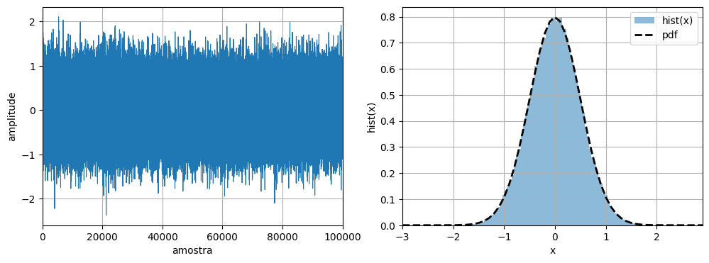
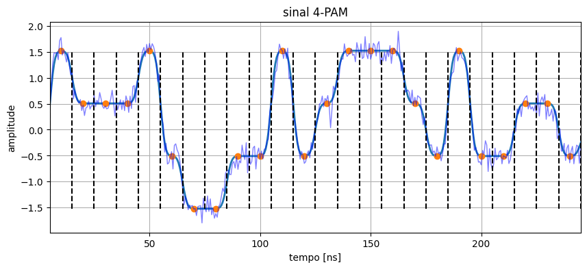
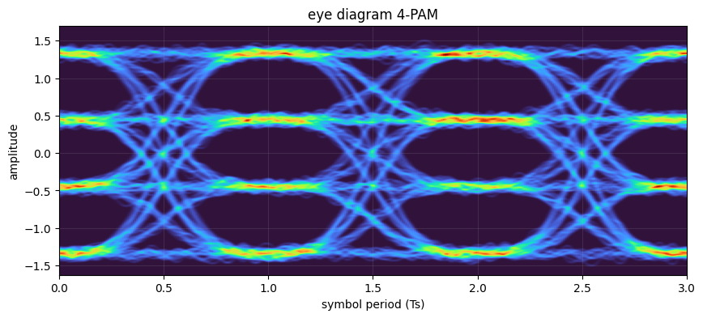

# Transmissão Digital da Informação

# Sistemas de Transmissão Digital da Informação

 

## Canal AWGN

Quando transmitidos pelo canal de comunicações, o sinais enviados pelo transmissor estão sujeitos a diversos tipos de distorção. Efeitos de filtragem, interferência, distorção não-linear e diversos tipos de ruído podem estar presentes no canal de comunicações, afetando a qualidade dos sinais que chegam ao receptor. 

O modelo de canal mais importante para a análise de sistemas de comunicações digitais é o que assume que sinais transmitidos serão afetados pela presença de ruído branco gaussiano aditivo (*additive white Gaussian noise* - AWGN). Nesse modelo, o ruído é representado por um processo aleatório gaussiano, ou seja, para cada instante $t$ no tempo, o ruído $n(t)$ adicionado ao sinal é dado por uma variável aleatória gaussiana de média $\mu$ igual a zero e com uma certa variância $\sigma^2$. Desse modo, seja $s(t)$ o sinal enviado pelo transmissor ao canal, o modelo de canal AWGN assume que um ruído $n(t)$ será adicionado ao sinal de informação durante o processo de comunicação, como indicado na figura a seguir

em que $r(t)$ representa o sinal ruidoso na entrada do receptor.

Uma das principais fontes de ruído em sistemas de comunicações é o ruído térmico. O ruído Johnson-Nyquist (ruído térmico, ruído de Johnson ou ruído de Nyquist) é o ruído eletrônico gerado pela agitação térmica dos portadores de carga (geralmente os elétrons) dentro de um condutor elétrico, que ocorre independentemente de haver ou não tensão aplicada sobre o elemento. O ruído térmico está presente em todos os circuitos elétricos e eletrônicos. A presença de ruído em circuitos eletônicos reduz a sensibilidade de receptores na detecção de sinais de potência reduzida. Alguns equipamentos eletrônicos que requerem alta sensibilidade, como receptores de telescópios de rádio, precisam ser resfriados à temperaturas criogênicas para reduzir o ruído térmico em seus circuitos.

### Variável aleatória com distribuição gaussiana

Seja $X$ uma v.a. contínua com distribuição normal (gaussiana) de média $\mu$ e variância $\sigma^2$, i.e. $X \sim \mathcal{N}\mathrm{(\mu, \sigma^2)}$, a função densidade de probablidade de $X$ será dada por

$$
p_X\left(x\right)=\frac{1}{\sqrt{2 \pi \sigma^{2}}} e^{-\frac{(x-\mu)^{2}}{2 \sigma^{2}}}
$$

para $-\infty <x < \infty$.

Exemplos:

Seja $P(x_1 < X < x_2)$ a probabilidade de X assumir valores no intervalo $[x_1, x_2]$, temos que

em que $\operatorname{erf}(x) =\frac{2}{\sqrt{\pi}} \int_0^x e^{-u^2} \mathrm{~d} u$.

### Processo estocástico gaussiano estacionário

Um processo estocástico gaussiano estacionário $X(t)$ é um processo aleatório no qual a distribuição de probabilidade conjunta de qualquer conjunto finito de variáveis aleatórias $\mathbf{X} = \left[X(t_1), X(t_2), \dots X(t_n) \right]^T$ possuirá uma distribuição conjunta gaussiana, ou seja, uma função densidade de probabilidade (fdp) dada por

$$\begin{equation} p_{\mathbf{X}}(\mathbf{x}) = \frac{1}{\sqrt{(2\pi)^n|\Sigma|}} e^{-\frac{1}{2} (\mathbf{x}-\mathbf{\mu})^T \Sigma^{-1} (\mathbf{x}-\mu)} \end{equation}\label{eq1}$$

onde $\mathbf{x}$ é um vetor coluna de dimensão $n$, $\mathbf{\mu}$ é um vetor coluna de médias de dimensão $n$, $\Sigma$ é uma matriz de covariância $n \times n$, $|\Sigma|$ é o determinante de $\Sigma$ e $^T$ representa a transposição. No caso de processos gaussianos, se as variáveis aleatórias forem mutuamente independentes, $\Sigma = \mathrm{diag}(\sigma_1^2, \sigma_2^2, \dots, \sigma_n^2)$ será uma matriz diagonal e temos que ($\ref{eq1}$) pode ser simplificada para

$$ \begin{eqnarray} p_{\mathbf{X}}(\mathbf{x}) &=& p(x_1)p(x_2)\dots p(x_n) \\ &=&\prod_{k=1}^n \frac{1}{\sqrt{2\pi \sigma_k^2}} e^{-\frac{1}{2} \frac{(x_k-\mu_k)^2}{\sigma_k^2}} \end{eqnarray}\label{eq2}$$

A propriedade de estacionariedade em um processo estocástico implica que suas estatísticas não variam ao longo do tempo. Em outras palavras, as médias e variâncias das variáveis aleatórias do processo são constantes temporalmente e as funções de autocorrelação e covariância dependem apenas da diferença entre os instantes de tempo, não do tempo em si. Essa propriedade é de grande importância na análise de processos estocásticos, pois permite simplificar a modelagem e a análise de sistemas complexos. Ao assumir que o processo é estacionário, podemos reduzir a dimensão do problema e concentrar nossos esforços na caracterização da estatística do processo em vez de sua dinâmica temporal.

### Propriedades importantes:

1. Para processos gaussianos, o conhecimento da média e da autocorrelação, i.e., $\mu_X(t)$ e $R_X(t_1, t_2)$ provê uma descrição estatística completa do processo.

2. Se um processo gaussiano $X(t)$ passa por um sistema linear e invariante no tempo (LIT), então a saída $Y(t)$ do sistema também é um processo gaussiano.

3. Para processos gaussianos, estacionariedade no sentido amplo (WSS) implica em estacionariedade estrita.

4. Uma condição suficiente para a ergodicidade de um processo estacionário de média nula $X(t)$ é que

$$\int_{-\infty}^{\infty}\left|R_X(\tau)\right| d \tau<\infty$$.

## Ruído aditivo gaussiano branco

O ruído gaussiano branco $N(t)$ é um processo estocástico estacionário em que qualquer conjunto as amostras das realizações do processo são independentes e identicamente distribuídas (i.i.d.) com uma distribuição gaussiana de média zero e variância constante. O termo "branco" refere-se ao fato de que a densidade espectral de potência do processo constante ao longo de todo o espectro de frequências, fazendo alusão à luz branca, que é composta pela combinação de todas as componentes de frequência (cores) do espectro visível.

### Filtrando o ruído gaussiano branco

### Exemplo: ruído térmico

A densidade de potência do ruído térmico é dada por

$$ S_n(f)=\frac{\hbar f}{2\left(e^{\frac{\hbar f}{k T}}-1\right)} $$

em que $f$ é a frequência em $Hz$, $\hbar=6.6 \times 10^{-34} \mathrm{~J}\mathrm{s}$ é a constante de Planck, $k=1.38 \times 10^{-23}  \mathrm{~J}\mathrm{K}$ é a constante de Boltzmann e $T$ é a temperatura em Kelvin.

Observações:

* O espectro acima assume valor máximo $\frac{kT}{2}$ em $f=0$ Hz;
* $\lim_{f\to \pm \infty} S_n(f) = 0$, porém a taxa de convergência é muito lenta.  Ex.: a 300 K, $S_n(f)=0.9S_n(0)$ para $f=2\times 10^{12} Hz$  

Logo, para efeitos práticos:

$$ S_n(f)=\frac{kT}{2} $$

Considerando um intervalo de frequências $[-B/2, B/2]$, a potência de ruído térmico presente nessa banda será dada por

$$
\begin{aligned}
& P_n=\int_{-B/2}^{B/2} \frac{k T}{2} d f \\
& P_n=\frac{k T}{2} \cdot 2 \frac{B}{2} =k T B/2
\end{aligned}
$$

### Gerando numericamente realizações de um processo gaussiano

Veja que o sinal ilustrado acima é a realização de um processo estocástico gaussiano estacionário. Cada amostra corresponde a uma realização de uma variável aleatória (v.a) gaussiana de média nula ($\mu=0$) e variância $\sigma^2$. As variáveis aleatórias, por sua vez, são independentes e idênticamente distribuídas (i.i.ds). Vamos calcular a potência do sinal acima, considerando que para um processo ergódico na correlação, podemos assumir:

$$P_x=E\left[X^2\right] = \mu^2 + \sigma^2\approx \frac{1}{N}\sum_{k=1}^{N} x^2[k]$$

Note que esta última expressão é a mesma expressão para cálculo da potência média de um sinal determinístico. Logo, temos que:

### Efeito do ruído em sistemas de comunicação digital

## Relação sinal-ruído

A relação sinal-ruído (ou razão sinal-ruído, *signal-to-noise ratio* - $\mathrm{SNR}$) é uma das grandezas mais importantes na engenharia de sistemas de comunicações. A $\mathrm{SNR}$ é um indicador da presença de ruído no sistema, ou seja, a presença de distorções aleatórias e indesejáveis que afetam os sinais que carregam informação, dificultando ou impossibilitando o processo de comunicação. 

A $\mathrm{SNR}$ é definida como sendo a razão entre a potência de sinal $P_s$ e a potência do ruído $P_n$ observadas num dado sistema:

$$\mathrm{SNR} = \frac{P_s}{P_n}$$

em que $P_s = E\left[|s(t)|^2\right]$ e $P_n=E\left[|n(t)|^2\right]$, com $E[.]$ denotando valor esperado.

Quando expressa em decibéis (dB), a $\mathrm{SNR}$ é dada por

$$ \mathrm{SNR}_{dB} = 10\log_{10}P_s-10\log_{10}P_n.$$

Quanto maior a $\mathrm{SNR}$ maior a diferença entre a potência do sinal de interesse e a potência do ruído adicionado á mesma. Dessa forma, quanto maior a $\mathrm{SNR}$ melhor a qualidade do sinal.

## Referências

[1] J. G. Proakis, M. Salehi, Digital Communications, 4th Edition, McGraw Hill, 2001.
