# Transmissão Digital da Informação

# Receptores ótimos para canais AWGN

 
Fig.1: Diagrama de blocos de um sistema de transmissão digital genérico.

##  O modelo de canal AWGN

Considere o modelo de canal em que os sinais transmitidos são afetados apenas por ruído branco gaussiano aditivo (*additive white Gaussian noise* - AWGN). Nesse modelo, o ruído é representado por um processo aleatório gaussiano, ou seja, para cada instante $t$ no tempo, o ruído $n(t)$ adicionado ao sinal é dado por uma variável aleatória gaussiana de média $\mu$ igual a zero e com uma certa variância $\sigma^2$. Desse modo, seja $s(t)$ o sinal enviado pelo transmissor ao canal, o modelo de canal AWGN assume que um ruído $n(t)$ será adicionado ao sinal de informação durante o processo de comunicação, como indicado na figura a seguir

Fig.2: Esquemático de um sistema de transmissão digital via canal AWGN.

em que $r(t)$ representa o sinal ruidoso na entrada do receptor.

Assuma que em cada intervalo de sinalização $T_s$, o transmissor envia um sinal $s_m(t)$ dentre os $M$ possíveis do esquema de modulação utilizado, i.e. $\left\lbrace s_m(t), m = 1,2,\dots, M\right\rbrace$. Considere que no intervalo de $0\leq t \leq T_s$ o transmissor enviou a sinal $s_m(t)$. Uma vez que o canal adiciona ruído ao sinal transmitido, o sinal recebido $r(t)$ no intervalo $0\leq t \leq T_s$ pode ser expresso como

$$\begin{equation}\label{awgnch_eq1} r(t) = s_m(t) + n(t)\end{equation}$$

em que $n(t)$ é uma função amostra de um processo estocástico gaussiano com densidade espectral de potência $S_n(f)=\frac{N_0}{2}$.

## Receptores e receptores ótimos

Baseado na observação de $r(t)$ durante o intervalo de sinalização, o receptor tem a tarefa de inferir qual dos $M$ possíveis sinais foi enviado pelo transmissor. Uma vez que o canal adiciona uma perturbação aleatória ao sinal transmitido, o processo de inferência passa a ter caráter probabilístico. Nesse sentido, sempre existe a possibilidade de que o canal altere a forma do sinal $s_m(t)$ de modo que o sinal recebido possa se assemelhar a um outro sinal do conjunto  $\left\lbrace s_m(t), m = 1,2,\dots, M\right\rbrace$ diferente do que foi transmitido. Logo, se o receptor assume que o sinal transmitido é aquele que tem maior proximidade com o sinal recebido, a presença de ruído pode levar a erros no processo de deteção da informação transmitida. O projeto de receptores ótimos, então, baseia-se no estabelecimento de esquemas de recepção que minimizem a probabilidade da ocorrência de erros no processo de decisão da informação transmitida atrabés do canal.

Como ilustrado na figura abaixo, a tarefa do receptor pode ser subdividida em duas partes:

* **Demodulação**: conversão do sinal recebido $r(t)$ em um vetor de amostras discretas $\mathbf{r} = [r_1,r_2,\dots, r_N]$, em que $N$ é a dimensão dos sinais transmitidos.

* **Detecção**: a partir de $\mathbf{r}$, decidir qual dos $M$ possíveis sinais foram transmitidos.

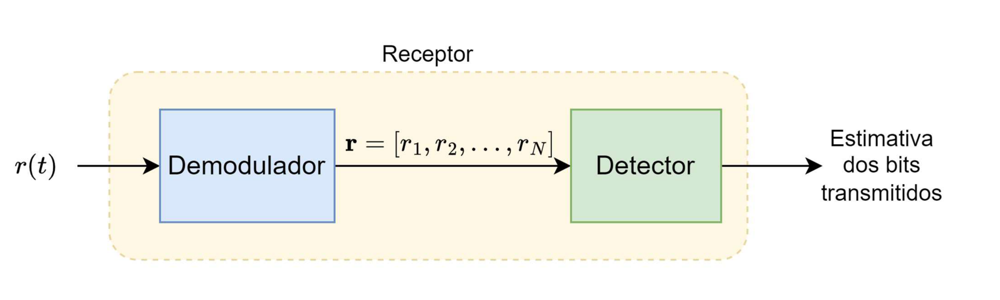

Fig.3: Estrutura de blocos de um receptor digital.

Para entendermos a tarefa do demodulador, precisamos recorrer ao conceito de espaço de sinais. Considere que os sinais $s_m(t)$ gerados pelo transmissor possam ser expandidos a partir de uma base de $N$ funções ortonormais $f_n(t)$, isto é

$$\begin{equation} s_m(t) = \sum_{k=1}^{N}s_{mk}f_k(t) \end{equation}$$

em que o vetor $\mathbf{s}_m = [s_1, s_2, \dots, s_N]$ corresponde à representação de $s_m(t)$ na base ortonormal $\left\lbrace f_n(t) \right\rbrace_{n=1}^{N}$. Por base ortonormal, entende-se que o produto interno entre duas funções $f_i(t)$ e $f_j(t)$ quaisquer da base obedece a seguinte propriedade

$$\begin{equation} 
\langle f_i(t), f_j(t) \rangle = \int_{-\infty}^{\infty}f_i(t)f_j^*(t) dt = \begin{cases} 1, & \text{ se } i=j\\ 0, & \text{ se } i\neq j \end{cases} \end{equation} $$

em que $^*$ indica o conjugado complexo.

Assim, podemos decompor o sinal $s_m(t)$ em suas componentes vetorias $s_1, s_2, \dots, s_N$ na base $\left\lbrace f_n(t) \right\rbrace_{n=1}^{N}$ realizando o produto interno entre $s_m(t)$ e cada elemento da base no intervalo 
$0\leq t \leq T_s$:

$$\begin{equation} 
\langle s_m(t), f_i(t) \rangle = \int_{0}^{T}s_m(t)f_i^*(t) dt = s_i \end{equation} $$

em que $s_i$ é o componente vetorial de $s_m(t)$ na direção de $f_i(t)$.

### Demodulador por correlação

Na Fig.4 a estrutura de um demodulador por correlação está ilustrada. No receptor, o sinal recebido é correlacionado com cada uma das $N$ funções que compõem a base ortonormal $\left\lbrace f_k(t) \right\rbrace_{k=1}^{N}$, ou seja, cada correlator corresponde à operação

$$\begin{align} 
\langle r(t), f_k(t) \rangle =& \int_{0}^{T}r(t)f_k(t) dt\nonumber  \\
=& \int_{0}^{T}[s_m(t) + n(t)]f_k(t) dt \nonumber  \\
=& \int_{0}^{T}s_m(t)f_k(t)dt + \int_{0}^{T}n(t)f_k(t) dt \nonumber \\
=& s_{mk} + n_k = r_k
\end{align} $$

com $k=1, 2,\dots, M$.

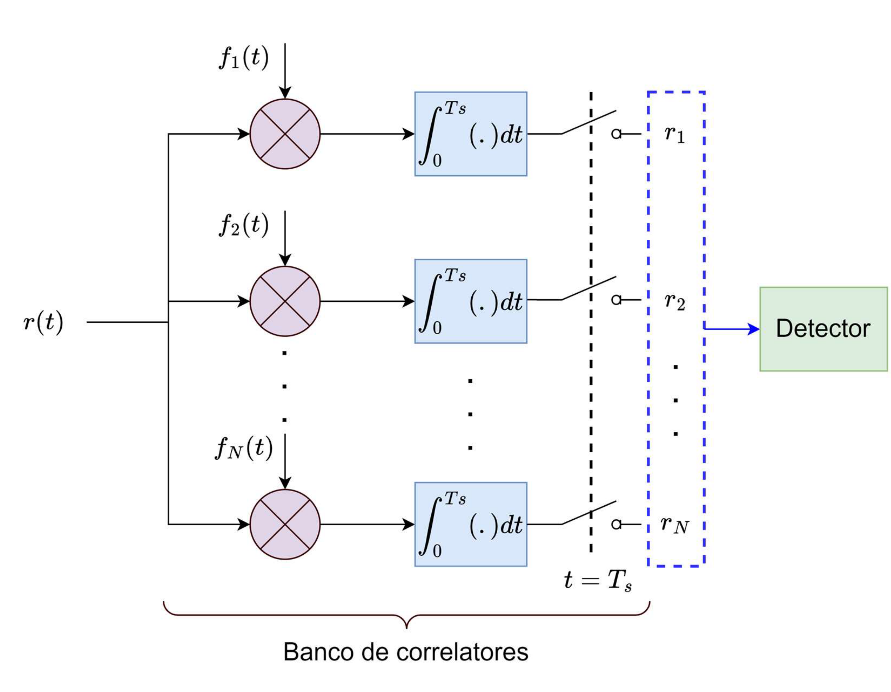

Fig.4: Demodulador por correlação.

A partir das projeções de $r(t)$ e $n(t)$ nas funções da base ortonormal, podemos escrever

$$\begin{align} r(t) & =\sum_{k=1}^N s_{m k} f_k(t)+\sum_{k=1}^N n_k f_k(t)+n^{\prime}(t) \nonumber \\ & =\sum_{k=1}^N r_k f_k(t)+n^{\prime}(t)\end{align}$$

em que $n^{\prime}(t)=n(t)-\sum_{k=1}^N n_k f_k(t)$ corresponde aos componentes do ruído que são ortogonais à base ortonormal utilizada na transmissão.

Utilizando as propriedades da média e da autocorrelação do processo estocástico gaussiano estacionário associado ao ruído, temos que:

$$\begin{equation}
E\left[n_k\right]=\int_0^{T_s} E[n(t)] f_k(t) dt=0
\end{equation}$$

e 

$$
\begin{align}
E\left[n_k n_m\right] & = E\left[ \int_0^{T_s} n(t) f_k(t) dt \int_0^{T_s} n(\tau) f_m(\tau) d\tau\right] \nonumber \\
& = \int_0^{T_s} \int_0^{T_s} E[n(t) n(\tau)] f_k(t) f_m(\tau) d t d \tau \nonumber \\
& =\frac{N_0}{2}  \int_0^{T_s} \int_0^{T_s} \delta(t-\tau) f_k(t) f_m(\tau) d t d \tau \nonumber \\
& = \frac{N_0}{2} \int_0^{T_s} f_k(t) \left[\int_0^{T_s} \delta(t-\tau)  f_m(\tau) d \tau \right] d t \nonumber \\
& =\frac{N_0}{2} \int_0^{T_s} f_k(t) f_m(t) d t \nonumber \\
& =\frac{N_0}{2} \delta_{m k}
\end{align}
$$

Desse modo, os termos $n_k$ são variáveis aleatórias gaussianas independentes e identicamente distribuídas (i.i.d), com média nula e variância $\sigma_n^2 = E[n_k^2] = \frac{N_0}{2}$.

Assumindo que o sinal $s_m(t)$ seja conhecido, podemos descrever os sinais $r_k$ na saída dos correlatores como variáveis aleatórias gaussianas independentes de média:

$$
\begin{equation}
E\left[r_k\right]=E\left[s_{m k}+n_k\right]=s_{m k} 
\end{equation}
$$
e variância
$$
\begin{align}
\sigma_r^2 &= E\left[r_k^2\right] - E[r_k]^2 \nonumber \\
&= E\left[s_{mk}^2 + 2s_{mk}n_k + n_k^2\right] - s_{mk}^2\nonumber \\
&= s_{mk}^2 + E[n_k^2] - s_{mk}^2\nonumber \\
&= \sigma_n^2=\frac{N_0}{2}.
\end{align}
$$

Portanto, o vetor $\mathbf{r}$ pode ser representado pela seguinte função densidade de probabilidade condicional conjunta

$$ \begin{equation}\label{pdf_conj_1}
p\left(\mathbf{r}|\mathbf{s}_m\right)=\prod_{k=1}^N p\left(r_k|s_{m k}\right), \quad m=1,2, \ldots, M
\end{equation} $$

em que cada componente vetorial possui distribuição condicional

$$\begin{equation}\label{pdf_conj_2}
p\left(r_k|s_{m k}\right)=\frac{1}{\sqrt{\pi N_0}} \exp \left[-\frac{\left(r_k-s_{mk}\right)^2}{N_0}\right], \quad k=1,2, \ldots, N.
\end{equation}$$

Substituindo ($\ref{pdf_conj_2}$) in ($\ref{pdf_conj_1}$), temos:

$$\begin{equation}\label{pdf_conj_3}
p\left(\mathbf{r}|\mathbf{s}_m\right)=\frac{1}{\left(\pi N_0\right)^{N/2}} \exp \left[-\sum_{k=1}^N \frac{\left(r_k-s_{m k}\right)^2}{N_0}\right], \quad m=1,2, \ldots, M
\end{equation}$$

Por fim, faz-se necessário demonstrar que $n^{\prime}(t)$ é irrelevante no processo de decisão sobre qual dos $M$ possíveis sinais foi enviado pelo transmissor. Para tanto, basta mostrar que $n^{\prime}(t)$ e as saídas dos correlatores $r_1, r_2, \dots, r_N$ são independentes. Uma vez que tanto $n^{\prime}(t)$ quanto $r_1, r_2, \dots, r_N$ tem estatística gaussiana, basta mostrar que estes são descorrelacionados. Desse, modo, temos:

$$\begin{aligned} 
E\left[n^{\prime}(t) r_k\right] &= E\left[n^{\prime}(t)\right] s_{m k}+E\left[n^{\prime}(t) n_k\right] \\
&=E\left[n^{\prime}(t) n_k\right] \\ 
&=E\left\{\left[n(t)-\sum_{j=1}^N n_j f_j(t)\right] n_k\right\} \\ 
&=E\left\{\left[n(t)n_k-\sum_{j=1}^N n_j n_k f_j(t)\right] \right\} \\ 
&=E\left\{\left[n(t)\int_0^T n(\tau) f_k(\tau) d\tau -\sum_{j=1}^N n_j n_k f_j(t)\right]  \right\} \\
&=\int_0^T E[n(t) n(\tau)] f_k(\tau) d \tau-\sum_{j=1}^N E\left[n_j n_k\right] f_j(t) \\ 
&=\frac{N_0}{2} f_k(t)-\frac{N_0}{2} f_k(t)=0
\end{aligned}$$

Logo, conclui-se que $n^{\prime}(t)$ e $r_1, r_2, \dots, r_N$ são estatisticamente independentes, sendo as saídas dos correlatores uma *estatística suficiente* para o detector decidir qual sinal foi enviado pelo transmissor. 

### Demodulador por filtro casado

De modo alternativo, o demodulador pode ser construído a partir de um banco de $N$ filtros lineares, como ilustrado na Fig.5. Assuma que a resposta ao impulso $h_k(t)$ de cada um dos $N$ filtros que compõem o banco seja dada por

$$ 
\begin{equation}
h_k(t)=f_k(T_s-t), \quad 0 \leqslant t \leqslant T
\end{equation}
$$

em que $\left\lbrace f_k(t) \right\rbrace_{k=1}^{N}$ são as $N$ funções da base orthonormal e que $h_k(t)=0$ fora do intervalo $0 \leqslant t \leqslant T$.

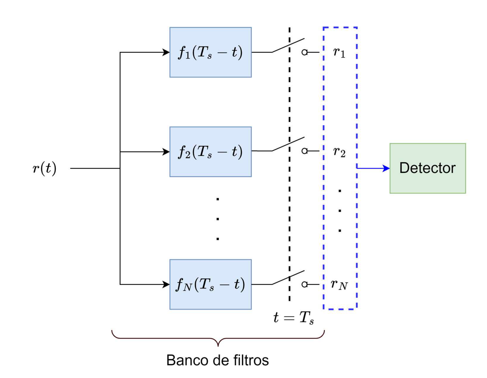

Fig.5: Demodulador por filtro casado.

Seja $y_k(t)$ a saída do $k$-ésimo filtro, temos que

$$ \begin{align} 
y_k(t) & =\int_0^t r(\tau) h_k(t-\tau) d \tau \\ 
& =\int_0^t r(\tau) f_k(T_s-t+\tau) d \tau, \quad k=1,2, \ldots, N.
\end{align}$$

Se amostrarmos $y_k(t)$ no instante $t=T_s$, temos

$$\begin{equation}
y_k(T_s)=\int_0^t r(\tau) f_k(\tau) d t=r_k, \quad k=1,2, \ldots, N
\end{equation}$$

Desse modo, a saída dos filtros amostrada em $t=T_s$ provê a mesma sequência de valores $r_1, r_2, \dots, r_N$ obtida na saída do banco de correlatores.

#### Filtro casado
Um filtro cuja resposta ao impulso é dada por $h(t) = s(T_s - t)$, em que $s(t)$ está confinada ao intervalo $0\leq t \leq T_s$, é denominado **filtro casado** ao sinal $s(t)$.

$$
\begin{equation}
y(t)=\int_0^t s(\tau) s(T_s-t+\tau) d \tau
\end{equation}
$$

#### Maximização da $\mathrm{SNR}$

A mais importante característica de um filtro casado é que se o sinal $s(t)$ estiver afetado por ruído AWGN, o filtro cuja resposta ao impulso maximiza a $\mathrm{SNR}$ do sinal após a filtragem é o filtro casado de $s(t)$. Para demonstrar essa propriedade, considere que o sinal $r(t) = s(t) + n(t)$ na saída do canal AWGN passa por um filtro de resposta ao impulso $h(t)$. A saída $y(t)$ do filtro será dada por

$$
\begin{align}
y(t) & =\int_0^t r(\tau) h(t-\tau) d \tau \\
& =\int_0^t s(\tau) h(t-\tau) d \tau+\int_0^t n(\tau) h(t-\tau) d \tau.
\end{align}
$$

Amostrando a saída do filtro em $t=T_s$, temos

$$
\begin{align}
y(T_s) & = \int_0^{T_s} s(\tau)h(T_s-\tau)d\tau + \int_0^{T_s}n(\tau)h(T_s-\tau)d\tau\nonumber \\
& = y_s(T_s)+y_n(T_s).
\end{align}
$$

Desse modo, podemos definir a $\mathrm{SNR}$ do sinal na saída do filtro como
$$
\begin{equation}\label{SNR_o}
\mathrm{SNR} = \frac{y_s^2(T_s)}{E\left[y_n^2(T_s)\right]},
\end{equation}
$$

em que o denominador $E\left[y_n^2(T_s)\right]$ corresponde à variância do ruído na saída do filtro, que podemos reescrever como:

$$
\begin{align}
E\left[y_n^2(T_s)\right] & =\int_0^{T_s} \int_0^{T_s} E[n(\tau) n(t)] h(T_s-\tau) h(T_s-t) d t d \tau \nonumber \\
& =\frac{N_0}{2} \int_0^{T_s} \int_0^{T_s} \delta(t-\tau) h(T_s-\tau) h(T_s-t) d t d \tau \nonumber \\
& =\frac{N_0}{2} \int_0^{T_s} h^2(T_s-t) d t.
\end{align}
$$

Logo, temos a seguinte expressão para a $\mathrm{SNR}$ na saída do filtro:
$$
\begin{equation}
\mathrm{SNR} =\frac{\left[\int_0^{T_s} s(\tau) h(T_s-\tau) d \tau\right]^2}{\frac{N_0}{2} \int_0^{T_s} h^2(T_s-t) d t}=\frac{\left[\int_0^{T_s} h(\tau) s(T_s-\tau) d \tau\right]^2}{\frac{N_0}{2} \int_0^{T_s} h^2(T_s-t) d t}.
\end{equation}
$$

Perceba que o termo  $\int_0^{T_s} h^2(T_s-t) d t$ no denominador corresponde à energia de $h(t)$, que pode ser mantida constante. Mantendo-se o denominador constante, a $\mathrm{SNR}$ será máxima se termo $\left[\int_0^{T_s} h(\tau) s(T_s-\tau) d \tau\right]^2$ do numerador for maximizado. Para tanto, considere o resultado da desigualdade de Cauchy-Schwarz que estabelece que para dois sinais $g_1(t)$ e $g_2(t)$ de energia finita 

$$
\begin{equation}
\left[\int_{-\infty}^{\infty} g_1(t) g_2(t) d t\right]^2 \leqslant \int_{-\infty}^{\infty} g_1^2(t) d t \int_{-\infty}^{\infty} g_2^2(t) d t
\end{equation}
$$

com igualdade se, e somente se, $g_1(t) = Cg_2(t)$, sendo $C$ uma constante arbitrária. Logo, a $\mathrm{SNR}$ será máxima quando $h(\tau) = Cs(T_s - \tau)$, ou seja, quando a resposta ao impulso $h(t)$ for casada ao sinal $s(t)$. Neste caso, tem-se que

$$
\begin{align}
\mathrm{SNR} & = \frac{\int_0^{T_s} C^2s^2(T_s-\tau) d \tau \int_0^{T_s}s^2(T_s-\tau) d \tau}{\frac{N_0}{2} \int_0^{T_s} C^2s^2(T_s-t) d t} \nonumber \\
& =\frac{2}{N_0} \int_0^{T_s} s^2(T_s-\tau) d \tau \nonumber \\
& =\frac{2}{N_0} \int_0^{T_s} s^2(t) d t\nonumber \\
& = \frac{2E}{N_0}
\end{align}
$$

em que $E = \int_0^{T_s} s^2(t) d t$ é a energia do sinal $s(t)$. Portanto, a $\mathrm{SNR}$ depende apenas da energia do sinal $s(t)$ e não de qualquer outra característica do mesmo.

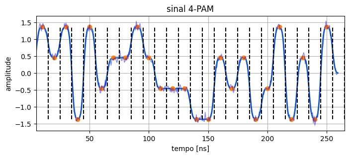

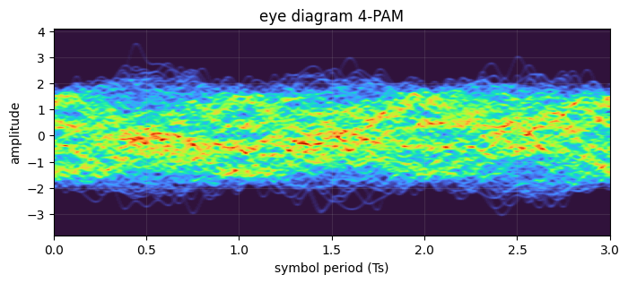

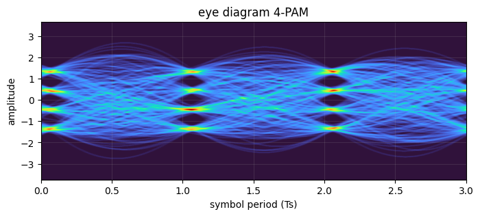

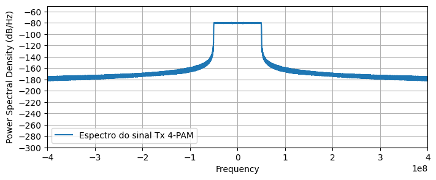

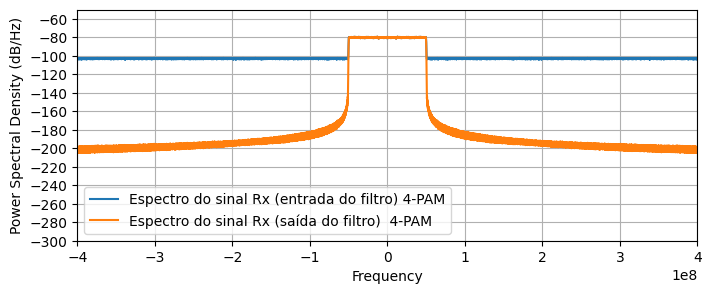

## Detectores ótimos

Após a etapa de demodulação, tanto para a demodulação por correlação como para a demodulação por filtro casado, o receptor dispõe de um vetor de amostras $\mathbf{r} = [r_1, r_2, \dots, r_N]$, com distribuição condicional dada por

$$\begin{equation}\label{pdf_conj_4}
p\left(\mathbf{r}|\mathbf{s}_m\right)=\frac{1}{\left(\pi N_0\right)^{N/2}} \exp \left[-\sum_{k=1}^N \frac{\left(r_k-s_{m k}\right)^2}{N_0}\right], \quad m=1,2, \ldots, M,
\end{equation}$$

em que $s_{m k}$ são as componentes ortogonais dos símbolos da constelação e $N_0/2$ a variância do ruído gaussiano adicionado pelo canal. O vetor $\mathbf{r}$ contém toda a informação relevante sobre o sinal recebido. 

Na sequência, com base em $\mathbf{r}$, o receptor deve decidir que símbolo foi transmitido. Esta função é realizada pelo detector. Para cada intervalo de sinalização, baseado na observação de $\mathbf{r}$, o detector deve decidir que símbolo $\mathbf{s}_m$ foi transmitido. O detector ótimo é aquele que maximiza a probabilidade de acerto do símbolo transmitido, ou equivalentemente, minimiza a probabilidade de erro. Para tanto, considera-se uma regra de decisão baseada no cálculo das probabilidades *a posteriori*

$$\begin{equation}\label{posterior_1}
P\left(\text{símbolo }\mathbf{s}_m \text{ foi transmitido}|\mathbf{r}\right), \quad m=1,2, \ldots, M,
\end{equation}$$

abreviadas para $P\left(\mathbf{s}_m|\mathbf{r}\right)$. A regra de decisão a ser implementada consiste em selecionar o símbolo que corresponde ao máximo do conjunto de probabilidades $\left\lbrace P\left(\mathbf{s}_m|\mathbf{r}\right) \right\rbrace$. Será demonstrado que esta regra é ótima, ou seja, é aquela que maximiza a probabilidade de acerto no processo de decisão.

### Critério de decisão MAP
Inicialmente, antes de observar $\mathbf{r}$, o receptor conhece apenas as probabilidades $P(\mathbf{s}_m)$ do transmissor ter enviado cada símbolo $\mathbf{s}_m$. Estas probabilidades representam um conhecimento prévio do receptor acerca dos sinais transmitidos, sendo denominadas probabilidades *a priori*. Uma vez observada a saída do canal $\mathbf{r}$, o receptor pode melhorar a sua estimativa sobre o símbolo transmitido calculando as probabilidades *a posteriori* $P\left(\mathbf{s}_m|\mathbf{r}\right)$ para cada símbolo da constelação e, então, decidir por aquele de maior probabilidade. Este critério de decisão é conhecido como critério de máxima probabilidade *a posteriori* (*maximum a posteriori probability* - MAP).

Utilizando a regra de Bayes, podemos escrever

$$
\begin{align}
P\left(\mathbf{s}_m|\mathbf{r}\right)&=\frac{p\left(\mathbf{r}|\mathbf{s}_m\right) P\left(\mathbf{s}_m\right)}{p(\mathbf{r})}\nonumber\\
&= \frac{p\left(\mathbf{r}|\mathbf{s}_m\right) P\left(\mathbf{s}_m\right)}{\sum_{m=1}^M p\left(\mathbf{r}|\mathbf{s}_m\right) P\left(\mathbf{s}_m\right)}\label{posterior_2}
\end{align}
$$

em que $p\left(\mathbf{r}|\mathbf{s}_m\right)$ é a função densidade de probabilidade condicional de $\mathbf{r}$ dado que $\mathbf{s}_m$ foi transmitido, $P\left(\mathbf{s}_m\right)$ é a probabilidade *a priori* de $\mathbf{s}_m$ ter sido transmitido.

Perceba que no cálculo de $P\left(\mathbf{s}_m|\mathbf{r}\right),\; m=1,2, \ldots, M$, o somatório no denominador da equação ($\ref{posterior_2}$) é independente de $m$, representando apenas um fator de normalização. Logo, seja $\hat{\mathbf{s}}_m$ o símbolo decidido pelo detector, o critério MAP de decisão pode ser expresso como

$$
\begin{align}
\hat{\mathbf{s}}_m &= \arg\max_{\mathbf{s}_m}P\left(\mathbf{s}_m|\mathbf{r}\right)\nonumber\\
&= \arg\max_{\mathbf{s}_m}p\left(\mathbf{r}|\mathbf{s}_m\right)P\left(\mathbf{s}_m\right)\label{MAP_crit}
\end{align}
$$

### Critério de decisão ML

Para o caso em que os símbolos enviados pelo transmissor são equiprováveis, $P\left(\mathbf{s}_m\right) = \frac{1}{M},\; m=1,2, \ldots, M$,  e o critério de decisão MAP definido em ($\ref{MAP_crit}$) pode ser simplificado para

$$
\begin{align}
\hat{\mathbf{s}}_m &= \arg\max_{\mathbf{s}_m}P\left(\mathbf{s}_m|\mathbf{r}\right)\nonumber\\
&= \arg\max_{\mathbf{s}_m}p\left(\mathbf{r}|\mathbf{s}_m\right)\label{ML_crit}
\end{align}
$$

Desse modo, o critério de decisão ótima requer apenas da avaliação da função $p\left(\mathbf{r}|\mathbf{s}_m\right)$. Uma vez que esta densidade de probabilidade condicional (ou qualquer função monotônica da mesma) é conhecida como *função de verossimilhança*, o novo critério denomina-se *critério de máxima verossimilhança*.

### Métricas de decisão

Para o canal AWGN, a função de verossimilhança é dada pela equação ($\ref{pdf_conj_4}$). Por conveniência na simplificação dos cálculos a serem realizados no receptor, utiliza-se a função logaritmo natural de $p\left(\mathbf{r}|\mathbf{s}_m\right)$, que é uma função monotônica, de modo que

$$
\begin{equation}\label{loglikeli}
\ln p\left(\mathbf{r}|\mathbf{s}_m\right)=\frac{-N}{2} \ln \left(\pi N_0\right)-\frac{1}{N_0} \sum_{k=1}^N\left(r_k-s_{m k}\right)^2.
\end{equation}
$$

Maximizar $\ln p\left(\mathbf{r}|\mathbf{s}_m\right)$ equivale a minimizar o somatório do lado direito de ($\ref{loglikeli}$). Por outro lado, este somatório corresponde ao quadrado da distância euclidiana entre $\mathbf{r}$ e $\mathbf{s}_m$. Logo, podemos definir a seguinte métrica $D\left(\mathbf{r}, \mathbf{s}_m\right)$ de distância euclidiana

$$
\begin{equation}\label{metric_dist}
D\left(\mathbf{r}, \mathbf{s}_m\right)=\sum_{k=1}^N\left(r_k-s_{m k}\right)^2 = \| \mathbf{r} - \mathbf{s}_m \|^2.
\end{equation}
$$

Portanto, para a aplicação do critério ML é suficiente que o receptor decida pelo símbolo $\mathbf{s}_m$ que está mais próximo ao sinal recebido $\mathbf{r}$.

Um segundo critério pode ser derivado a partir da expansão de ($\ref{metric_dist}$) em
$$
\begin{align}
D\left(\mathbf{r}, \mathbf{s}_m\right) & =\sum_{n=1}^N r_n^2-2 \sum_{n=1}^N r_n s_{m n}+\sum_{n=1}^N s_{m n}^2 \nonumber \\
&=\|\mathbf{r}\|^2-2 \mathbf{r} \cdot \mathbf{s}_m+\left\|\mathbf{s}_m\right\|^2, \quad m=1,2, \ldots, M.
\end{align}
$$

Notando que $\|\mathbf{r}\|^2$ é um termo comum a todas $D\left(\mathbf{r}, \mathbf{s}_m\right)$, este pode ser suprimido e a métrica pode ser reescrita como

$$
\begin{equation}\label{metric_dist2}
D^{\prime}\left(\mathbf{r}, \mathbf{s}_m\right)=-2 \mathbf{r} \cdot \mathbf{s}_m+\left\|\mathbf{s}_m\right\|^2.
\end{equation}
$$

Minimizar ($\ref{metric_dist2}$) equivale a maximizar 

$$
\begin{equation}\label{metric_corr}
C \left(\mathbf{r}, \mathbf{s}_m\right) = 2 \mathbf{r} \cdot \mathbf{s}_m-\left\|\mathbf{s}_m\right\|^2.
\end{equation}
$$

A métrica $C \left(\mathbf{r}, \mathbf{s}_m\right)$ é denominada *métrica de correlação*. Nesta métrica, o receptor decide pelo símbolo $\mathbf{s}_m$ que apresenta maior métrica de correlação com o $\mathbf{r}$.

Tanto $D\left(\mathbf{r}, \mathbf{s}_m\right)$ quanto $C\left(\mathbf{r}, \mathbf{s}_m\right)$ são métricas que podem ser utilizadas no caso de todos os símbolos $\mathbf{s}_m$ serem equiprováveis. Entretanto, caso essa condição não seja satisfeita, o critério MAP deve ser aplicado diretamente, o que significa maximizar a seguinte métrica de probabilidade *a posteriori*

$$
\begin{equation}\label{metric_prob}
\operatorname{PM}\left(\mathbf{r}, \mathbf{s}_m\right)= p\left(\mathbf{r}|\mathbf{s}_m\right) P\left(\mathbf{s}_m\right).
\end{equation}
$$

$$
\begin{align}\label{metric_prob_2}
\ln\left[p\left(\mathbf{r}|\mathbf{s}_m\right)P\left(\mathbf{s}_m\right)\right]&=\frac{-N}{2} \ln \left(\pi N_0\right)-\frac{1}{N_0} \sum_{k=1}^N\left(r_k-s_{m k}\right)^2 + \ln P\left(\mathbf{s}_m\right).\nonumber\\
&\propto \sigma_n^2\ln \left(P\left(\mathbf{s}_m\right)\right) - \sum_{k=1}^N\left(r_k-s_{m k}\right)^2 \\
\end{align}
$$

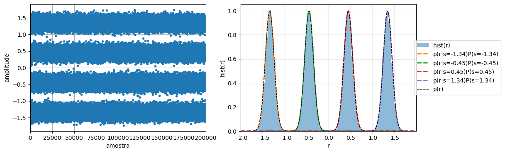

### Implementação de detectores MAP e ML

### Exemplo: sinal M-PAM equiprovável

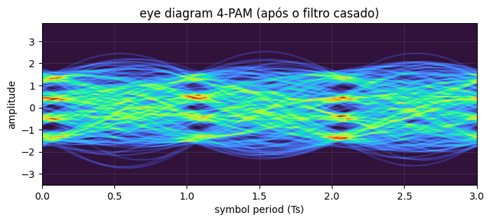

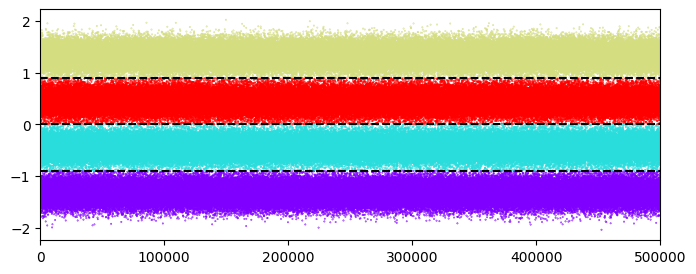

### Exemplo: sinal M-PAM não-equiprovável

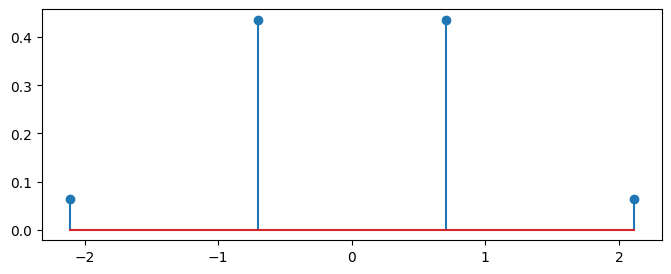

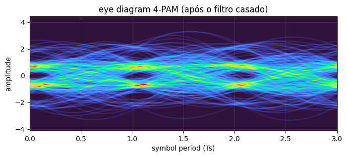

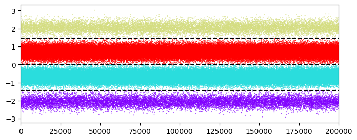

### Exemplo: sinal M-QAM equiprovável

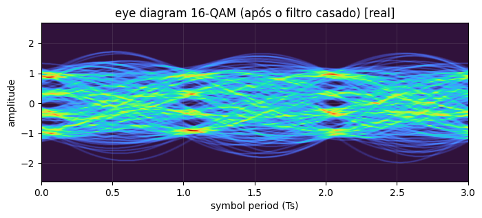

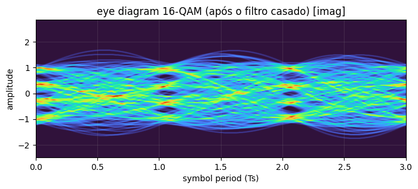

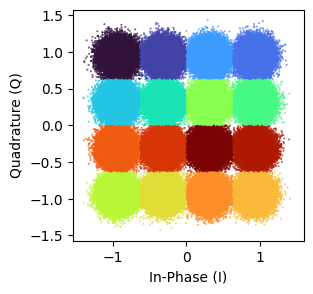

### Exemplo: sinal M-QAM não-equiprovável

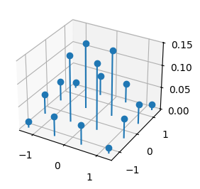

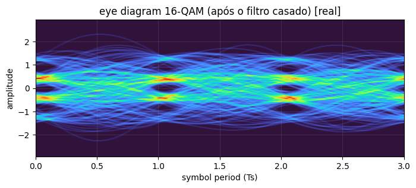

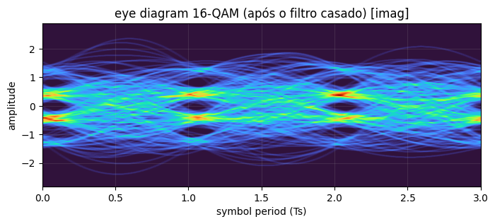

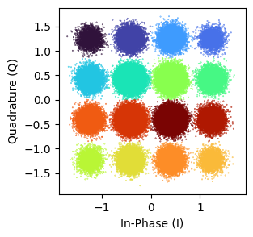

## Cálculo da probabilidade de erro para modulações sem memória em canais AWGN

### Modulações binárias antipodais

Considere o caso da modulação binária PAM, em que o transmissor envia os sinais $s_1(t) = g(t)$ e $s_2(t) = -g(t)$. Seja $E_g = \int_{0}^{T_s} g^2(t)dt$ a energia do pulso, a base ortonormal para os sinais ${s_1(t),s_2(t)}$ contém apenas uma função dada por $u(t) = \frac{g(t)}{\sqrt{E_g}}$. Logo, a constelação da modulação possui dois símbolos representados por $s_1 = -\sqrt{E_g}$ e $s_2 = \sqrt{E_g}$. Considere que os dois símbolos são equiprováveis, i.e. $P(s_1) = P(s_2)= \frac{1}{2}$.

Considerando que os sinais são transmitidos por um canal AWGN, num dado instante de sinalização a saída $r$ do demodulador será dada por

$$\begin{equation}
r = s + n,
\end{equation}$$

em que $n$ é uma variável aleatória gaussiana de média 0 e variância $\sigma^2 = \frac{N_0}{2}$. Neste caso, a regra de decisão ótima correspondente ao critério MAP consiste na comparação entre o valor de $r$ e o limiar de decisão $l_d$. Se $r<l_d$, decide-se que $s=s_1$. Caso contrário, decide-se que $s=s_2$. No caso de sinais binários equiprováveis, temos que $l_d = 0$.
Teremos, então, as seguintes distribuições condicionais de $r$ dado $s$

$$
\begin{align}
p\left(r|s_1\right)&=\frac{1}{\sqrt{\pi N_0}} e^{-\left(r+\sqrt{\mathcal{E}_g}\right)^2 / N_0} \nonumber\\
p\left(r|s_2\right)&=\frac{1}{\sqrt{\pi N_0}} e^{-\left(r-\sqrt{\mathcal{E}_g}\right)^2 / N_0} \nonumber
\end{align}
$$
Seja $P(e)$ a probabilidade de ocorrência de um erro no processo de detecção implementado no receptor, temos que

$$
\begin{align}
P(e|s_1) = P\left(r>0|s_1\right) & =\int_{0}^\infty p\left(r|s_1\right) d r \nonumber\\
& =\frac{1}{\sqrt{\pi N_0}} \int_{0}^\infty e^{-\left(r + \sqrt{E_g}\right)^2 / N_0} d r \nonumber\\
& =\frac{1}{\sqrt{2 \pi}} \int_{\sqrt{2 E_g / N_0}}^{\infty} e^{-x^2 / 2} d x \nonumber\\
& =Q\left(\sqrt{\frac{2 E_g}{N_0}}\right)
\end{align}
$$

em que 
$$
\begin{align}Q(x)&=\frac{1}{\sqrt{2 \pi}} \int_x^{\infty} \exp \left(-\frac{u^2}{2}\right) d u \nonumber  \\
&=\frac{1}{2} \operatorname{erfc}\left(\frac{x}{\sqrt{2}}\right)\end{align}$$

De maneira análoga, temos

$$
\begin{align}
P(e|s_2) = P\left(r<0|s_2\right) & =\int_{-\infty}^0 p\left(r|s_2\right) d r \nonumber\\
& =\frac{1}{\sqrt{\pi N_0}} \int_{-\infty}^0 e^{-\left(r - \sqrt{E_g}\right)^2 / N_0} d r\nonumber \\
& =\frac{1}{\sqrt{2 \pi}} \int_{-\infty}^{-\sqrt{2 E_g / N_0}} e^{-x^2 / 2} d x \nonumber\\
& =\frac{1}{\sqrt{2 \pi}} \int_{\sqrt{2 E_g / N_0}}^{\infty} e^{-x^2 / 2} d x \nonumber\\
& =Q\left(\sqrt{\frac{2 E_g}{N_0}}\right)
\end{align}
$$

Logo, a probabilidade de erro $P(e)$ é dada por

$$
\begin{align}
P(e) & = P\left(e|s_1\right)P\left(s_1\right)+P\left(e|s_2\right)P\left(s_2\right)\nonumber \\
& =\frac{1}{2} P\left(e|s_1\right)+\frac{1}{2} P\left(e|s_2\right)\nonumber  \\
& = Q\left(\sqrt{\frac{2 E_g}{N_0}}\right)
\end{align}
$$

Perceba que a probabilidade de erro é função apenas da relação sinal-ruído $\mathrm{SNR} = \frac{E_s}{\sigma_n^2} = \frac{2E_g}{N_0}$ na entrada do receptor.

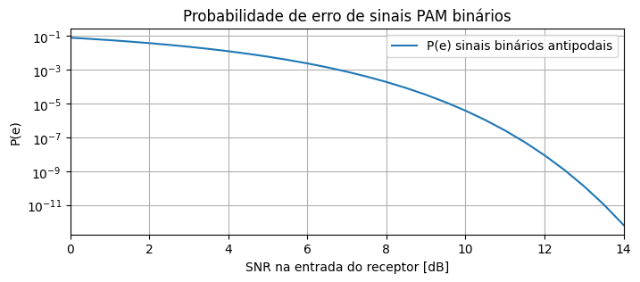

### Modulações binárias ortogonais

Considere que disponhamos de um espaço de sinais bidimensional para gerar o conjunto de sinais da modulação. Suponha que escolhamos o seguinte par ortogonal de vetores para compor um esquema de modulação binário

$$
\begin{aligned}
& \mathbf{s}_1=\left[\sqrt{E_g}, 0\right] \\
& \mathbf{s}_2=\left[0, \sqrt{E}_g\right]
\end{aligned}
$$

em que $E_g$ representa a energia de cada um dos sinais. Note que a distância euclidiana entre $\mathbf{s}_1$ e $\mathbf{s}_2$ é $d_{12} = \sqrt{2E_g}$. 

Assumindo que o sinal $\mathbf{s}_1$ foi transmitido, as saída do demodulador será dada por

$$
\begin{equation}
\boldsymbol{r}=\left[\sqrt{E_g}+n_1, n_2\right]
\end{equation}
$$

Uma vez que ambos os símbolos são equiprováveis e possuem a mesma energia, a métrica de correlação pode ser utilizada no processo de detecção ótima.

$$\begin{equation}
P\left(e \mid \mathbf{s}_1\right)=P\left[C\left(\mathbf{r}, \mathbf{s}_2\right)>C\left(\mathbf{r}_1, \mathbf{s}_1\right)\right]=P\left[n_2-n_1>\sqrt{E}_g\right] = P\left[n>\sqrt{E}_g\right]
\end{equation}$$

Sabe-se que $n_1$ e $n_2$ são variáveis aleatórias gaussianas de média nula e variância $N_0/2$. Portanto, lembrando que a soma (ou subtração) de variáveis aleatórias gaussianas de média nula resulta numa variável aleatória gaussiana de média nula cuja variância é a soma das variâncias individuais, temos que $n$ tem mécia nula e variância $N_0$. Logo,

$$
\begin{align}
P\left(n_2-n_1>\sqrt{E_g}\right) & =\frac{1}{\sqrt{2 \pi N_0}} \int_{\sqrt{E_g}}^{\infty} e^{-x^2 / (2 N_0)} d x\nonumber \\
&=\frac{1}{\sqrt{2 \pi}} \int_{\sqrt{E_g / N_0}}^{\infty} e^{-x^2 / 2} d x\nonumber \\
&=Q\left(\sqrt{\frac{E_g}{N_0}}\right)
\end{align}
$$

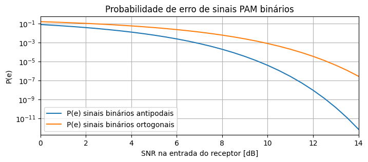

### Modulações M-PAM

Os símbolos da constelação M-PAM podem ser representados por

$$
\begin{equation}
s_m=\sqrt{E_g} A_m, \quad m=1,2, \ldots, M
\end{equation}
$$
com
$$
\begin{equation}
A_m=(2 m-1-M), \quad m=1,2, \ldots, M
\end{equation}
$$

em que a distância entre símbolos adjacentes é $d=2\sqrt{E_g}$. 

Sabendo que
$$
\sum_{k=1,3,5,...}^{2n-1} k^2=\frac{n(4n^2-1)}{3},
$$

e considerando o caso padrão em que os símbolos são idependentes e equiprováveis, podemos calcular a energia média por símbolo da constelação como sendo
$$
\begin{align}
E_{a v} & =\frac{1}{M} \sum_{m=1}^M s_m^2 \nonumber \\
& =\frac{E_g}{M} \sum_{m=1}^M(2 m-1-M)^2 \nonumber  \\
& =\frac{E_g}{M} 2\sum_{k=1,3,...}^{M-1}k^2 \nonumber  \\
& =\frac{E_g}{M} 2\frac{(M/2)\left(4(M/2)^2-1\right)}{3} \nonumber \\
& =\frac{E_g}{M} \frac{M\left(M^2-1\right)}{3} \nonumber \\
& =\left(\frac{M^2-1}{3}\right) E_g
\end{align}
$$

Logo, considerando o canal AWGN, o decisor deve tomar uma decisão sobre que símbolo foi transmitido baseado no seguinte sinal $r$:
$$
\begin{equation}
r=s_m+n=\sqrt{E_g} A_m + n
\end{equation}
$$

em que $n$ é uma variável aleatória gaussiana de média nula e variância $\sigma^2 = \frac{N_0}{2}$.

Se todos os símbolos forem equiprováveis, a probabilidade de erro média é dada pela probabilidade de que $n$ exceda a metade da distância entre símbolos adjacentes, para os símbolos internos, somada à probabilidade de erro para os dois símbolos externos. Desse modo,

$$
\begin{align}
P_{e|PAM} & =\frac{M-2}{M} P\left(\left|r-s_m\right|>\sqrt{E_g}\right) + \frac{1}{M} P\left(r-s_1>\sqrt{E_g}\right) + \frac{1}{M} P\left(r-s_M<\sqrt{E_g}\right)\nonumber \\
& =\frac{M-1}{M} P\left(\left|r-s_m\right|>\sqrt{E_g}\right)\nonumber  \\
& =\frac{M-1}{M} \frac{2}{\sqrt{\pi N_0}} \int_{\sqrt{E_g}}^{\infty} e^{-x^2 / N_0} d x \nonumber \\
& =\frac{M-1}{M} \frac{2}{\sqrt{2 \pi}} \int_{\sqrt{2 E_g / N_0}}^{\infty} e^{-x^2 / 2} d x\nonumber  \\
& =\frac{2(M-1)}{M} Q\left(\sqrt{\frac{2 E_g}{N_0}}\right)
\end{align}
$$

Logo, podemos escrever $P_{e|PAM}$ em termos de $E_{a v}$ como

$$
\begin{equation}
P_{e|PAM} =\frac{2(M-1)}{M} Q\left(\sqrt{\frac{6}{(M^2-1)}\frac{E_{av}}{N_0}}\right)
\end{equation}
$$

Em termos da energia média por bit $E_b = \frac{E_{av}}{\log_2M}$, temos

$$
\begin{equation}
P_{e|PAM} =\frac{2(M-1)}{M} Q\left(\sqrt{\frac{6\log_2M}{(M^2-1)}\frac{E_b}{N_0}}\right)
\end{equation}
$$

Em termos da $\mathrm{SNR} = \frac{E_{av}}{\sigma^2} = \frac{2E_{av}}{N_0}$, temos

$$
\begin{equation}
P_{e|PAM} =\frac{2(M-1)}{M} Q\left(\sqrt{\frac{3}{(M^2-1)}\mathrm{SNR}}\right)
\end{equation}
$$

e em termos da razão sinal-ruído por bit $\mathrm{SNR}_b = \frac{\mathrm{SNR}}{\log_2M}$

$$
\begin{equation}
P_{e|PAM} =\frac{2(M-1)}{M} Q\left(\sqrt{\frac{3\log_2M}{(M^2-1)}\mathrm{SNR_b}}\right)
\end{equation}
$$

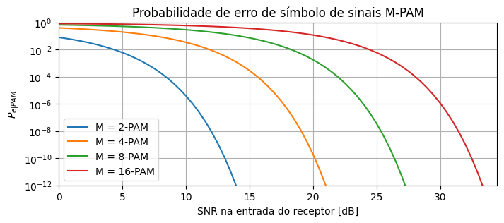

### Modulações M-PSK

Os símbolos da constelação M-PSK podem ser representados por $\mathbf{s}_m = \sqrt{E_s}e^{j\theta_m} = \sqrt{E_s}(\cos{\theta_m}+j\operatorname{sen}\theta_m)$, em que $\theta_m = (m-1)\frac{2\pi}{M}$, com $m=1,2,\dots, M$ e $E_s$ é a energia de cada símbolo da constelação.

Uma vez que todos os símbolos da constelação possuem a mesma energia. O detector ótimo para esse esquema de modulação no canal AWGN pode ser implementado calculando a métrica de correlação entre o sinal recebido $\mathbf{r} = [r_1, r_2]$ e os símbolos da constelação $\mathbf{s}_m$:

$$
C\left(\mathbf{r}, \mathbf{s}_m\right)=\mathbf{r} \cdot \mathbf{s}_m, \quad m=1,2, \ldots, M.
$$

Este detector é equivalente a um detector de fase que calcula a fase do sinal recebido $\theta_r = \tan^{-1} (r_2/r_1)$ e decide pelo símbolo $\mathbf{s}_m$ cuja fase está mais próxima de $\theta_r$. Para determinar a probabilidade de erro, temos que determinar a fdp de $\theta_r$.

Considere o caso em que a fase do símbolo transmitido é zero $\theta = 0$. Temos, então: $\mathbf{s}_1 =\left[\sqrt{E_s}, 0\right]$. O sinal recebido terá componentes

$$
\begin{align}
& r_1 = \sqrt{E_s} + n_1 \nonumber\\
& r_2 = n_2\nonumber
\end{align}
$$

Considerando que $n_1$ e $n_2$ são duas variáveis aleatórias gaussianas idependentes de média nula e variância $\sigma_n^2$, a distribuição condicional conjunta de $[r_1,r_2]$ é dada por

$$
\begin{equation}\label{gauss_cart}
p(r_1, r_2|\mathbf{s}_1) = \frac{1}{2 \pi \sigma_n^2} \exp \left[- \frac{ \left(r_1-\sqrt{E}_s \right)^2 + r_2^2}{2\sigma_n^2}\right]
\end{equation}
$$

A fdp de $\theta_r$ é obtida passando ($\ref{gauss_cart}$) para coordenadas polares. Seja $v = \sqrt{r_1^2 + r_1^2}$, temos então:

$$
\begin{equation}\label{gauss_polar}
p\left(v, \theta_r|\mathbf{s}_1\right)=\frac{v}{2 \pi \sigma_n^2} \exp \left(-\frac{v^2+E_s-2 \sqrt{E_s}v \cos \theta_r}{2 \sigma_n^2}\right)
\end{equation}
$$

Para obter $p\left(\theta_r|\mathbf{s}_1\right)$, integramos ($\ref{gauss_polar}$) em $v$ no intervalo $0$ a $\infty$, ou seja,

$$
\begin{align}
p\left(\theta_r|\mathbf{s}_1\right) & =\int_0^{\infty}p\left(v, \theta_r|\mathbf{s}_1\right) dv \nonumber\\
& =\frac{1}{2 \pi} e^{-2 \gamma_r \sin ^2 \theta_r} \int_0^{\infty} v e^{-\left(v-\sqrt{4 \gamma_r} \cos \theta_r\right)^2 / 2} d v
\end{align}
$$

em que $\gamma_r = \frac{E_s}{N_0}$. Portanto, dado que $\mathbf{s}_1$ foi transmitido, a detecção correta ocorrerá sempre que  $-\pi/M \leq \theta_r \leq \pi/M$. Logo, a probabilidade de erro será dada por

$$
\begin{equation}\label{prob_err_psk}
P(e|\mathbf{s}_1)=1-\int_{-\pi/M}^{\pi/M} p\left(\theta_r|\mathbf{s}_1\right) d \theta_r
\end{equation}
$$

Na maoria dos casos, não existe nenhuma forma simplificada para a integral em ($\ref{prob_err_psk}$), de modo que esta necessita ser calculada numericamente.

$$
\begin{align}
P_e & \approx 1-\int_{-\pi / M}^{\pi / M} \sqrt{\frac{\frac{2E_s}{N_0}}{\pi}} \cos \theta_r e^{-\frac{2E_s}{N_0} \sin ^2 \theta_r} d \theta_r\nonumber \\
& \approx \frac{2}{\sqrt{2 \pi}} \int_{\sqrt{\frac{2E_s}{N_0}} \sin \frac{\pi}{M}}^{\infty} e^{-u^2 / 2} d u \nonumber \\
& =2 Q\left(\sqrt{\frac{2E_s}{N_0}} \sin \frac{\pi}{M}\right) \nonumber \\
& =2 Q\left(\sqrt{k \frac{2E_b}{N_0}} \sin \frac{\pi}{M}\right)
\end{align}
$$

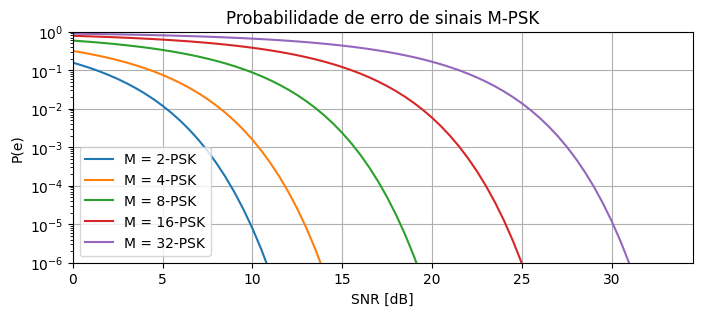

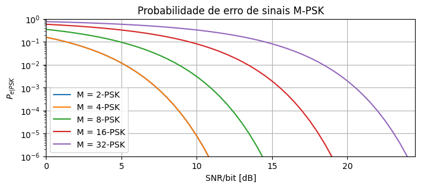

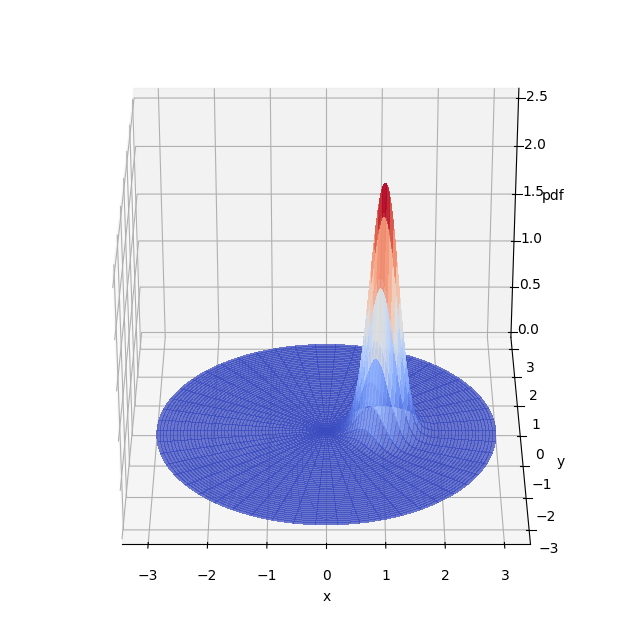

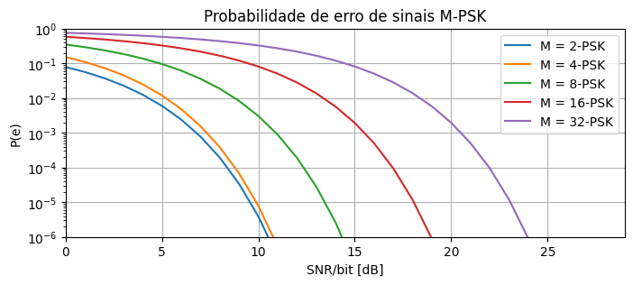

### Modulações M-QAM "quadradas" (*square M-QAM*)

Assuma que em cada intervalo de sinalização $T_s$, o transmissor envia um sinal $s(t)$ dentre os $M$ possíveis de uma modulação M-QAM, i.e. $s_m(t) \in \left\lbrace s_1(t),s_2(t),\dots, s_M(t)\right\rbrace$. Considere que no intervalo de $0\leq t \leq T_s$ o transmissor enviou o sinal $s_m(t)$

$$\begin{align}
s_m(t) &= s_{mI}g(t)\cos(2\pi f_c t)-s_{mQ}g(t)\operatorname{sen}(2\pi f_c t)\nonumber\\
&= \Re\left[(s_{mI}+js_{mQ})g(t)\exp(j2\pi f_c t)\right]\nonumber\\
&= \Re\left[s_mg(t)\exp(j2\pi f_c t)\right]\nonumber
\end{align}
$$

em que $s_m = s_{mI}+js_{mQ}$ corresponde ao símbolo complexo da constelação. 

No caso de constelações M-QAM retangulares em que $M = 2^k$ e o número de bits por símbolo $k$ é par (e.g. $M = 4,16,64,256,\dots$), as componentes $s_{I}$ e $s_{Q}$ podem ser entendidas símbolos de uma constelação $\sqrt{M}$-PAM, ou seja

$$
\begin{equation}
s_{mI}, s_{mQ} \in \left\lbrace A_n | n=1,2, \ldots, \sqrt{M}\right\rbrace
\end{equation}
$$

$$
\begin{equation}
A_n = \sqrt{E_g}(2n-1-\sqrt{M}), \quad n=1,2, \ldots, \sqrt{M}
\end{equation}
$$

em que a distância entre símbolos adjacentes é $d=2\sqrt{E_g}$.

Neste caso, a energia média $E_{av}$ dos símbolos da constelação será dada por

$$
\begin{align}
E_{av} &= \frac{1}{M}\sum_{m=1}^{M}\| s_m\|^2 \nonumber\\
&= \sum_{m=1}^{M} (s_{mI}^2 + s_{mQ}^2)\nonumber\\
&=\frac{2\sqrt{M}E_g}{M} \sum_{m=1}^\sqrt{M} (2m-1-\sqrt{M})^2\nonumber \\
& =\frac{2\sqrt{M}E_g}{M} \frac{\sqrt{M}\left(M-1\right)}{3}\nonumber \\
& =E_g\frac{2\left(M-1\right)}{3}
\end{align}
$$

Um erro de símbolo ocorrerá no receptor se qualquer das componentes $s_{mI}$ e $s_{mQ}$ ultrapassar os respectivos limiares de decisão. Seja $P_{e|QAM}$ a probabilidade média de erro, temos que

$$
\begin{align}
P_{e|QAM} & = 1 - \left(1 - P_{e|PAM}\right)^2 \nonumber \\
& =1 - \left(1-\frac{2(\sqrt{M}-1)}{\sqrt{M}} Q\left(\sqrt{\frac{2 E_g}{N_0}}\right)\right)^2\nonumber\\
& =1 - \left(1-2\left(1 - \frac{1}{\sqrt{M}} \right)Q\left(\sqrt{\frac{2 E_g}{N_0}}\right)\right)^2\nonumber\\
& =1 - \left(1-4\left(1 - \frac{1}{\sqrt{M}} \right)Q\left(\sqrt{\frac{2 E_g}{N_0}}\right) + 4\left(1 - \frac{1}{\sqrt{M}} \right)^2Q^2\left(\sqrt{\frac{2 E_g}{N_0}}\right)\right)\nonumber\nonumber\\
&=4\left(1 - \frac{1}{\sqrt{M}} \right)Q\left(\sqrt{\frac{2 E_g}{N_0}}\right) - 4\left(1 - \frac{1}{\sqrt{M}} \right)^2Q^2\left(\sqrt{\frac{2 E_g}{N_0}}\right)\nonumber\\
&\leq 4\left(1 - \frac{1}{\sqrt{M}} \right)Q\left(\sqrt{\frac{2 E_g}{N_0}}\right) \nonumber\\
&\leq 4\left(1 - \frac{1}{\sqrt{M}} \right)Q\left(\sqrt{\frac{3}{(M-1)}\frac{E_{av}}{N_0}}\right) \\
\end{align}
$$

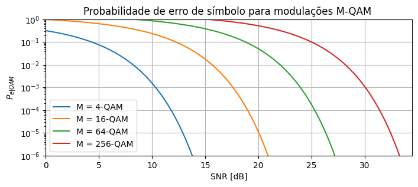

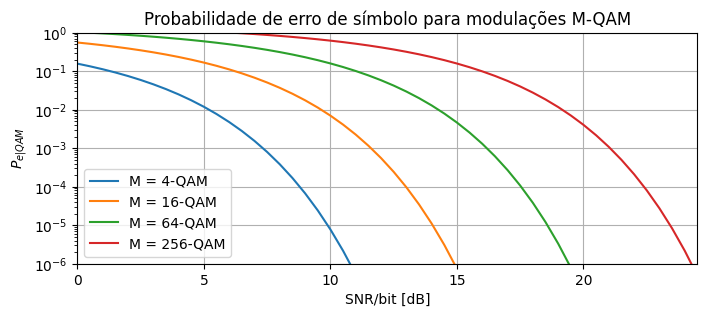

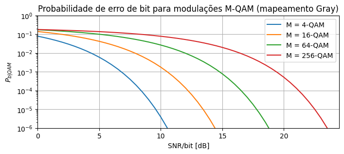

##  Limitante da união de probabilidades de erro

Sabemos que para uma constelação binária antipodal $s\in \left\lbrace -\sqrt{E_g}, \sqrt{E_g} \right\rbrace$ a probabilidade de erro é dada por

$$
\begin{equation}\nonumber
P_e^{bin} = Q\left(\sqrt{\frac{2 E_g}{N_0}}\right).
\end{equation}
$$

Considerando que a distância entre os símbolos é $d=2\sqrt{E_g}$, temos $E_g = \frac{d^2}{4}$, de modo que

$$
\begin{equation}\label{Pe_bin}
P_e^{bin} = Q\left(\sqrt{\frac{d^2}{2N_0}}\right).
\end{equation}
$$

ou seja, a probabilidade de erro depende apenas da densidade espectral de potência do ruído e da distância euclideana entre os dois símbolos da constelação.

A partir de ($\ref{Pe_bin}$) é possível obter um *limitante superior* da probabilidade de erro de símbolo para constelações arbitrárias, denominado limitante da união.

Para exemplificar o uso desse limitante, considere o caso da constelação 4-QAM ilustrada na Fig. 7. 

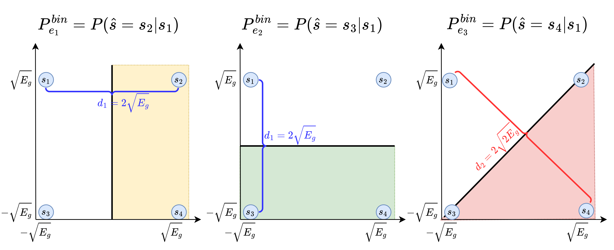

Fig.7: Regiões de decisão binárias para a constelação 4-QAM.

Assumindo $s_1$ como o símbolo transmitido, se calcularmos a probabilidade de erro de símbolo $P_e^{bin}$ para cada um dos demais símbolos da constelação temos

$$
\begin{align}
P_{e_1}^{b i n} &=P\left(\hat{s}=s_2 | s_1\right) = Q\left(\sqrt{\frac{d_1^2}{2N_0}}\right)\\
P_{e_2}^{b i n} &=P\left(\hat{s}=s_3 | s_1\right) = Q\left(\sqrt{\frac{d_1^2}{2N_0}}\right)\\
P_{e_3}^{b i n} &=P\left(\hat{s}=s_4 | s_1\right) = Q\left(\sqrt{\frac{d_2^2}{2N_0}}\right)\\
\end{align}
$$

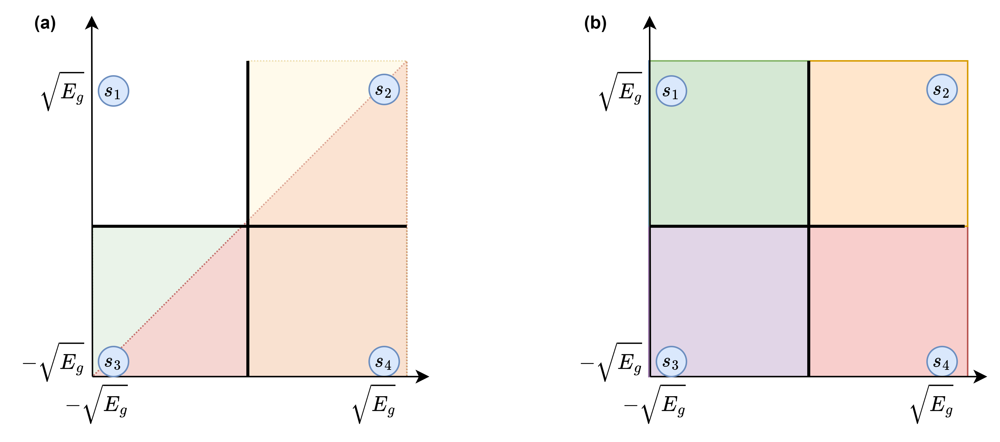

Fig.8: (a) Sobreposição das regiões de decisão binárias para a constelação 4-QAM. (b) Regiões de decisão para a constelação 4-QAM.

Perceba que a probabilidade de erro exata $P_{e|4-QAM}$ da constelação 4-QAM é dada pela integral da fdp $p(r_1, r_2|s_1)$ em todas as regiões de decisão associadas aos símbolos $s_m\neq s_1$. Desse modo, um limitante superior para o valor dessa integral é dado pelo somatório das integrais utilizadas na determinação de $P_e^{bin}$, ou seja

$$
\begin{align}
P_{e|4-QAM} &\leq P_{e_1}^{b i n} + P_{e_2}^{b i n} + P_{e_3}^{b i n}\nonumber\\
 &= Q\left(\sqrt{\frac{d_1^2}{2N_0}}\right) + Q\left(\sqrt{\frac{d_1^2}{2N_0}}\right) + Q\left(\sqrt{\frac{d_2^2}{2N_0}}\right)\nonumber\\
 &= 2Q\left(\sqrt{\frac{d_1^2}{2N_0}}\right) + Q\left(\sqrt{\frac{d_2^2}{2N_0}}\right)\nonumber\\
 &= 2Q\left(\sqrt{\frac{2E_g}{N_0}}\right) + Q\left(\sqrt{\frac{4E_g}{N_0}}\right)\label{limUni_4QAM}
\end{align}
$$

Para valores típicos de $\mathrm{SNR}$ em sistemas de comunicações, o segundo termo em ($\ref{limUni_4QAM}$) tende a ser muito menor do que o primeiro. Dessa forma, podemos constatar que a probabilidade de erro é dominada pela probabilidade de erro para os símbolos na vizinhança mais próxima do símbolo $s_1$. Se compararmos ($\ref{limUni_4QAM}$) com a probabilidade de erro exata $P_{e|4-QAM}=2 Q\left(\sqrt{\frac{2 E_g}{N_0}}\right)-Q^2\left(\sqrt{\frac{2 E_g}{N_0}}\right)$, vemos que os mesmos termos dominantes aparecem nas duas expressões.

De modo geral, podemos escrever:

$$
\begin{equation}
P_{e}=\sum_{i=1}^M P(\hat{s} \neq s_i| s_i) P(s_i) = \frac{1}{M} \sum_{i=1}^M P(\hat{s} \neq s_i| s_i)
\end{equation}
$$

em que a segunda igualdade é válida no caso de símbolos equiprováveis e 
$$
\begin{align}
P(\hat{s} \neq s_i| s_i) & \leq \sum_{k \neq i} P_e^{bin}(\hat{s} = s_k| s_i) \\
& =\sum_{k \neq i} Q\left(\frac{\left\|s_k-s_i\right\|}{\sqrt{2 N_0}}\right)
\end{align}
$$

ou seja,

$$
\begin{equation}
P_{e}\leq \frac{1}{M} \sum_{i=1}^M \sum_{k \neq i} Q\left(\frac{\left\|s_k-s_i\right\|}{\sqrt{2 N_0}}\right)
\end{equation}
$$

Finalmente, podemos considerar apenas os termos dominantes fazendo
$$
\begin{equation}
P_e \leq \frac{2 K}{M} Q\left(\frac{d_{\min }}{\sqrt{2 N_0}}\right)
\end{equation}
$$

em que $K$ é o número de pares de símbolos que encontram-se separados pela distância mínima $d_{min}$.

**Exemplo**: aplicação do limitante da união para constelações M-QAM.

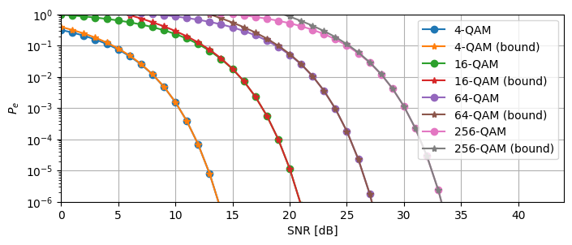

## Referências

[1] J. G. Proakis, M. Salehi, Communication Systems Engineering, 2nd Edition, Pearson, 2002.
