# Transmissão Digital da Informação

# Equalização em canais de comunicação

 
Fig.1: Diagrama de blocos de um sistema de transmissão digital genérico.

##  Canais distorcivos e limitados em banda

Na análise que segue, considere que o canal de comunicações pode ser modelado como um sistema linear com uma resposta ao impulso $h(t)$ e resposta em frequência $H(f)$ limitada a uma banda de $B$ Hz, de modo que 

$$
\begin{equation}
H(f) = \begin{cases}|H(f)|e^{\theta(f)}, & |f|<B \\ 0, & \text { caso contrário.}\end{cases}
\end{equation}
$$

e $H(f) = \int_{-\infty}^{\infty}h(t)e^{-2\pi f t} dt$, $|H(f)|$ é a resposta de amplitude e $\theta(f)$ a resposta de fase do canal. A partir da resposta de fase podemos definir o *atraso de grupo* como 

$$
\begin{equation}
\tau(f)=-\frac{1}{2 \pi} \frac{d \theta(f)}{d f}.
\end{equation}
$$

O atraso de grupo corresponde ao intervalo de tempo com que cada componente de frequência do sinal transmitido atravessa o canal linear. Um canal linear causará distorção nos sinais por ele transmitidos se $|H(f)|$ não for constante ou $\theta(f)$ não for uma função linear de $f$, ou seja, se o atraso de grupo não for constante para todos os componentes de frequência dentro da banda do canal.

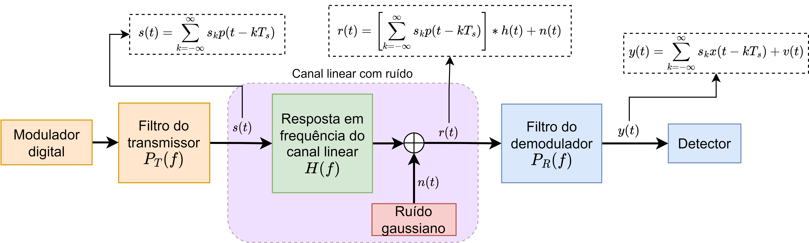

Fig.2: Esquemático de um sistema de transmissão digital via canal linear e AWGN.

### Interferência intersimbólica (ISI)

Assuma que no receptor o sinal $r(t)$ é filtrado e amostrado nos instantes $t=qT_s + \tau_{0}, q=0, 1, \ldots$. Seja a saída do filtro do receptor dada por

$$
\begin{equation}
y(t)=\sum_{k=-\infty}^{\infty} s_k x(t-kT_s) + v(t)
\end{equation}
$$

em que o pulso $x(t)$ é o resultado da convolução do pulso original $p(t)$ com a resposta ao impulso do canal $h(t)$ e a resposta ao impulso do filtro do recetor $p_{R}(t)$ e $v(t)$ é o resultado da convolução entre o ruído gaussiano na entrada do receptor e $p_{R}(t)$. Considerando apenas a representação discreta do sinal, temos
$$
\begin{equation}\label{ISI_eq1}
y[k]=s[k] + \sum_{\substack{n=-\infty \\ n \neq k}}^{\infty} s[n] x[k-n] + v[k], \quad k=0,1, \ldots
\end{equation}
$$

Em ($\ref{ISI_eq1}$), temos que $s[k]$ é o símbolo transmitido no intervalo de sinalização $k$. Já o termo $\sum_{\substack{n=-\infty \\ n \neq k}}^{\infty} s[n] x[k-n]$ representa a interferência causada em $s[k]$ pelos demais símbolos transmitidos, denominada **interferência intersimbólica** (*intersymbol interference* - ISI). Por fim, $v[k]$ é uma variável aleatória representado o ruído no instante de sinalização $k$.

### Minimização do critério do pico de distorção (*peak distortion criterion*)

Considere que utilizaremos como equalizador de $y[k]$ um filtro linear discreto no tempo com resposta ao impulso $c[m]$, de modo que
$$
z[k]=\sum_{m=-\infty}^{\infty} c[m]\,y[k-m].
$$
onde $z[k]$ é a saída do equalizador.

Substituindo $y[k]$ e reorganizando, temos
$$
z[k]=\sum_{n=-\infty}^{\infty} s[n]\,g[k-n] + w[k],
$$
onde a resposta equivalente é
$$
g[\ell]\triangleq c[\ell]\ast x[\ell] = \sum_{m=-\infty}^{\infty} c[m]\,x[\ell-m],
\qquad
w[k]\triangleq \sum_{m=-\infty}^{\infty} c[m]\,v[k-m].
$$
Assim,
$$
z[k]=s[k]g[0]+\sum_{\substack{n=-\infty \\ n \neq k}}^{\infty} s[n]g[k-n]+w[k].
$$

Normalizando o resultado por $g[0]$, temos

$$
z[k]=s[k]+\sum_{\substack{n=-\infty \\ n \neq k}}^{\infty} s[n]g[k-n]+w[k].
$$

Defina a distorção de pico como a energia dos termos fora do pico desejado
(assumindo pico em $\ell=0$):
$$
D(c) \triangleq \sum_{\substack{\ell=-\infty \\ \ell \neq 0}}^{\infty} |g[\ell]|^2.
$$

Como $D(c)\ge 0$, o mínimo global ocorre quando $D(c)=0$, isto é,

$$
g[\ell] = \delta[\ell] =
\begin{cases}
1, & \ell = 0 \\
0, & \ell \neq 0
\end{cases}
$$

Como $g[\ell]=c[\ell]\ast x[\ell]$, a condição ótima é
$$
c[\ell]\ast x[\ell]=\delta[\ell].
$$

No domínio-$z$,
$$
C(z)X(z) = 1,
\qquad
C(z)=\frac{1}{X(z)}.
$$

Sabemos que $X(z)=P_T(z)H(z)P_R(z)$. Logo, se $P_T(z)$ e $P_R(z)$ resultarem num pulso livre de ISI, basta que $$C(z)=\frac{1}{H(z)},$$

para que a saída do equalizador esteja livre de ISI. Este equalizador é conhecido como equalizador de zero-forçado (*zero-forcing*- ZF equalizer) .

Para garantir que o equalizador ZF seja **estável**, escolhe o canal deve ter uma função de transferência de **fase mínima**, isto é, com todos os zeros dentro do círculo unitário.

Considere que o canal $H(z)$ pode ser representado pela função de transferência 
$$
H(z)=\prod_{i=1}^{N}\left(1-a_i z^{-1}\right),
$$
com zeros em $z=a_i$. Assim, $H(z)$ será de fase-mínima se $|a_i|<1$ para todo $i$.

### Exemplo: aplicação de um equalizador ZF para compensação de ISI num canal linear

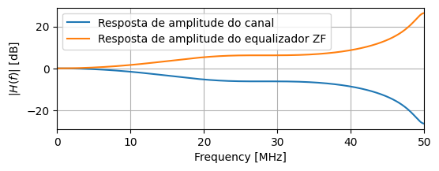

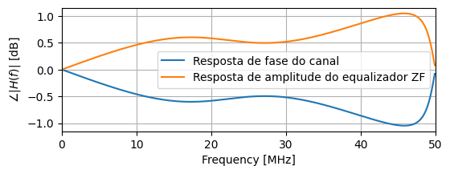

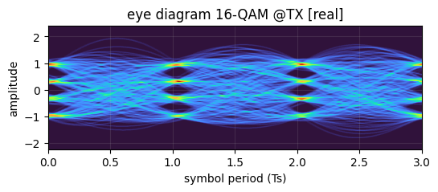

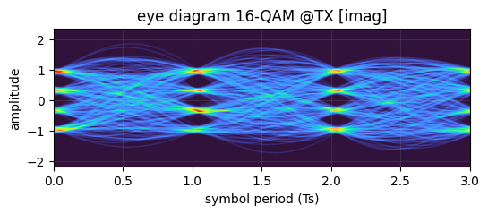

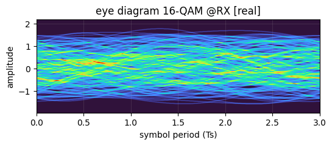

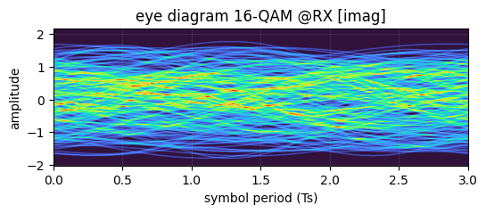

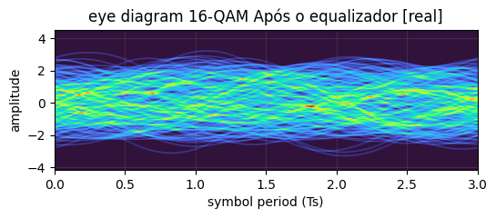

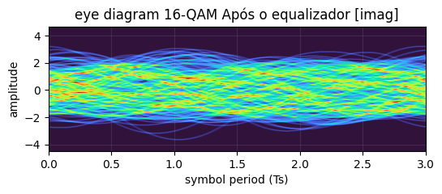

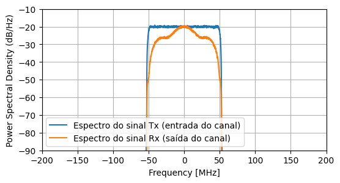

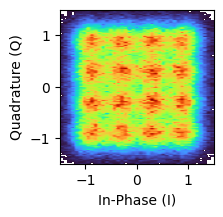

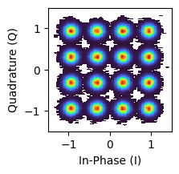

### Minimização do critério de erro médio quadrático (***mean-squared-error*** - **MSE**)

A utilização do critério do pico de distorção não leva em conta o ruído aditivo que afeta o sinal. Por esta razão, caso a resposta em frequência do canal atenue fortemente algum componente de frequência dentro da banda do sinal, o equalizador ZF aplicará um ganho correspondente para restaurar a potência de sinal. Entretanto, o mesmo ganho será aplicado ao ruído, o que pode reduzir severamente a $\mathrm{SNR}$ na entrada do detector, reduzindo o desempenho da transmissão.

Desse modo, o uso de equalizadores ZF é mais apropriado em situações onde a resposta em frequência do canal é relativamente plana, ou a $\mathrm{SNR}$ do sistema é elevada. Quando essas condições não são atendidas, uma melhor alternativa seria otimizar os coeficientes do filtro equalizador com relação a um critétio que leve em conta tanto o efeito da ISI como do ruído, de modo a obter o melhor compromisso em termos de equalização e desempenho. Um critério que atende esse cenário é o erro médio quadrático (***mean-squared error*** - **MSE**) entre o sinal na entrada do canal e a saída do equalizador. O conjunto de coeficientes que minimiza o MSE é conhecido como solução MMSE ou equalizador MMSE.

#### Determinação do equalizador MMSE

Assuma que saída do filtro casado no receptor pode ser expressa como

$$
y[k]=\sum_{n=0}^{N-1} h[n]s[k-n]+\eta[k]
$$

em que $\eta[k] \sim \mathcal{N}(0,\sigma_\eta^2)$ e $R_{\eta\eta}[m] = \mathbb{E}\{\eta[k]\eta^*[k-m]\}=\sigma_n^2\delta[m]$

Considerando que um equalizador com $N_1$ precursores e $N_2$ pós-cursores, o comprimento total do filtro será $
L=N_1+N_2+1,$

$$
\mathbf{y}[k]=[y[k-N_1],\ldots, y[k], \ldots ,y[k+N_2]]^T,
$$

$$
\mathbf{c}=[c[-N_1],\ldots, c[0], \ldots ,c[N_2]]^T,
$$

$$ \mathbf{s}[k] = \left[s[k-N_1], s[k-N_1+1],\ldots,s[k],\ldots, s[k+N_2+N]\right]^T$$

$$
\mathbf{\eta}[k]=[\eta[k-N_1],\ldots, \eta[k], \ldots ,\eta[k+N_2]]^T,
$$

O mesmo modelo pode ser escrito como uma matriz Toeplitz

$$
\mathbf{y}[k]=\mathbf{H}\mathbf{s}[k]+\mathbf{\eta}[k],
$$

onde estrutura de $\mathbf{H}$ é da forma

$$
\mathbf{H}=
\begin{bmatrix}
h[0] & h[1]  & \cdots & h[N-1] & 0 & \cdots & 0\\
0 & h[0] & h[1]  & \cdots & h[N-1] & \ddots & \vdots\\
\vdots & \ddots & \ddots & \ddots & \ddots & \ddots & 0\\
0 & \cdots & 0 & h[0] & h[1]  & \cdots & h[N-1]
\end{bmatrix}.
$$

$$
\mathbf{H}\in\mathbb{C}^{L\times L_x},
\qquad
L=N_1+N_2+1,
\qquad
L_x=N_1+N_2+N.
$$

Seja a saída do equalizador no instante $k$ dada por
$$
\hat s[k]=\mathbf{c}^H\mathbf{y}[k].
$$

temos que o erro entre a saída do filtro e a sequência de símbolos transmitida é dada por $e[k]\triangleq s[k]-\mathbf{c}^H\mathbf{y}[k]$.

Deseja-se obter o vetor de coeficientes $\mathbf{c}$ que minimiza a função objetivo definida como o valor esperado do erro-médio quadrático

$$
J(\mathbf{c})\triangleq \mathbb{E}\{|e[k]|^2\} = \mathbb{E}\{e[k]e^*[k]\}.
$$

Expandindo a funcão custo:
$$
\begin{aligned}
J(\mathbf{c})
 & =
\mathbb{E}\left\{
\left(s[k]-\mathbf{c}^H\mathbf{y}[k]\right)
\left(s^*[k]-\mathbf{y}^H[k]\mathbf{c}\right)
\right\}\\
&=\mathbb{E}\{|s[k]|^2\}
-
\mathbb{E}\{s[k]\mathbf{y}^H[k]\}\mathbf{c}
-
\mathbf{c}^H\mathbb{E}\{\mathbf{y}[k]s^*[k]\}
+
\mathbf{c}^H\mathbb{E}\{\mathbf{y}[k]\mathbf{y}^H[k]\}\mathbf{c}.
\end{aligned}
$$

Como $\mathbf{c}^H\mathbf{y}[k]$ é um escalar complexo, temos $\mathbf{c}^H\mathbf{y}[k] = (\mathbf{y}^H[k]\mathbf{c})^*$, e assim

$$
J(\mathbf{c})
=
\mathbb{E}\{|s[k]|^2\}
-
(\mathbf{c}^H\mathbb{E}\{\mathbf{y}[k]s^*[k]\})^*
-
\mathbf{c}^H\mathbb{E}\{\mathbf{y}[k]s^*[k]\}
+
\mathbf{c}^H\mathbb{E}\{\mathbf{y}[k]\mathbf{y}^H[k]\}\mathbf{c}.
$$

Definimos a matriz de correlação do vetor de entrada do filtro equalizador $\mathbf{R}_{yy}$ como

$$
\mathbf{R}_{yy}\triangleq \mathbb{E}\{\mathbf{y}[k]\mathbf{y}^H[k]\}\in\mathbb{C}^{L\times L}
$$

o vetor de correlação cruzada entre entrada e saída do equalizador $\mathbf{p}_{ys}$ como
$$
\mathbf{p}_{ys}\triangleq \mathbb{E}\{\mathbf{y}[k]s^*[k]\}\in\mathbb{C}^{L}.
$$

e a variância da sequência de símbolos $\sigma_s^2$ como
$$
\sigma_s^2 \triangleq \mathbb{E}\{|s[k]|^2\}
$$

e teremos 
 
$$
\begin{aligned}
J(\mathbf{c})
& =
\sigma_s^2
-
(\mathbf{c}^H\mathbf{p}_{ys})^*
-
\mathbf{c}^H\mathbf{p}_{ys}
+
\mathbf{c}^H\mathbf{R}_{yy}\mathbf{c}.
\\
& =
\sigma_s^2
-
\mathbf{p}_{ys}^H\mathbf{c}
-
\mathbf{c}^H\mathbf{p}_{ys}
+
\mathbf{c}^H\mathbf{R}_{yy}\mathbf{c}.
\end{aligned}
$$

Derivar $J(\mathbf{c})$ com relação a $\mathbf{c}^*$ no cálculo de Wirtinger equivale a derivar $J(\mathbf{c}_R, \mathbf{c}_I)$ com relação a $\mathbf{c}_R$ e $\mathbf{c}_I$ no cálculo real. 

Assim, encontrar o mínimo de $J(\mathbf{c})$ implica calcular o vetor de coeficientes $\mathbf{c}$ de tal forma que o gradiente de $J(\mathbf{c})$ seja nulo. No cálculo de Wirtinger, isso significa

$$\frac{\partial J(\mathbf{c})}{\partial \mathbf{c^*}}=0.$$  

Utilizando os resultados do cálculo de Wirtinger
$$
\frac{\partial}{\partial \mathbf{c}^*}(\mathbf{c}^H\mathbf{R}_{yy}\mathbf{c})=\mathbf{R}_{yy}\mathbf{c},
\qquad
\frac{\partial}{\partial \mathbf{c}^*}(\mathbf{c}^H\mathbf{p}_{ys})=\mathbf{p}_{ys},
\qquad
\frac{\partial}{\partial \mathbf{c}^*}(\mathbf{p}_{ys}^H\mathbf{c})=0.
$$

obtemos as equações de Wiener-Hopf cuja solução

$$
\mathbf{R}_{yy}\mathbf{c}_{\text{MMSE}}=\mathbf{p}_{ys}
\quad\Longrightarrow\quad
\boxed{\mathbf{c}_{\text{MMSE}}=\mathbf{R}_{yy}^{-1}\mathbf{p}_{ys}}.
$$

$$
\mathbf{R}_{yy}
=\mathbb{E}\{\mathbf{y}[k]\mathbf{y}[k]^H\}
=\mathbf{H}\mathbf{R}_{ss}\mathbf{H}^H+\mathbf{R}_{\eta\eta}.
$$

$$
\mathbf{R}_{\eta\eta} \triangleq \mathbb{E}\left\{\mathbf{\eta}[k] \mathbf{\eta}[k]^H\right\}\quad\Longrightarrow\quad
\mathbf{R}_{\eta\eta}=\sigma_\eta^2\mathbf{I}_L.
$$

Caso a sequência de símbolos seja estacionária e descorrelacionada, ou seja $R_{ss}[m]=\sigma_s^2\delta[m]$, temos: $\mathbf{R}_{ss} = \sigma_s^2 \mathbf{I}_{L_x}$

$$
\boxed{\mathbf{R}_{yy}=\sigma_s^2\mathbf{H}\mathbf{H}^H+\sigma_\eta^2\mathbf{I}_L.}
$$

Correlação cruzada
$$
\mathbf{p}_{yx}=\mathbb{E}\{\mathbf{y}[k]s^*[k]\}
=\mathbf{H}\,\mathbb{E}\{\mathbf{s}[k]s^*[k]\}
\triangleq \mathbf{H}\sigma_s^2 \mathbf{e}_{N_1}.
$$

$$
\boxed{\mathbf{p}_{ys}=\sigma_s^2\mathbf{H}\mathbf{e}_{N_1}.}
$$

$$
\mathbf{c}_{\text{MMSE}}
=
\big(\sigma_s^2\mathbf{H}\mathbf{H}^H+\sigma_\eta^2\mathbf{I}_L\big)^{-1}
\big(\sigma_s^2\mathbf{H}\mathbf{e}_{N_1}\big).
$$

e seja $\mathrm{SNR}=\sigma_s^2/\sigma_\eta^2$, temos

$$
\boxed{
\mathbf{c}_{\text{MMSE}}
=
\left(\mathbf{H}\mathbf{H}^H+\frac{1}{\mathrm{SNR}}\mathbf{I}_L\right)^{-1}
\left(\mathbf{H}\mathbf{e}_{N_1}\right).
}
$$

### Exemplo: aplicação de um equalizador MMSE para compensação de ISI num canal linear

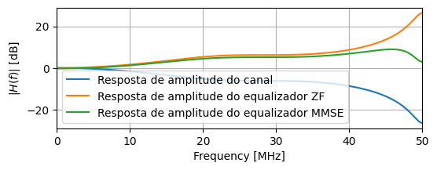

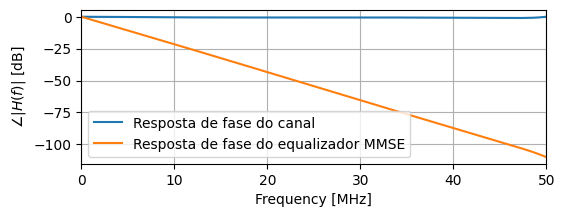

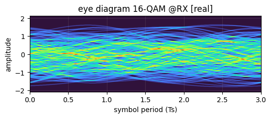

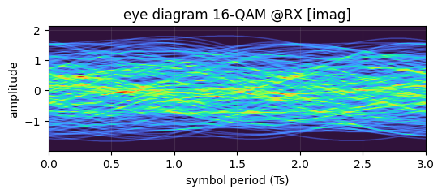

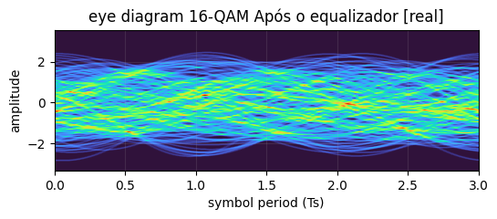

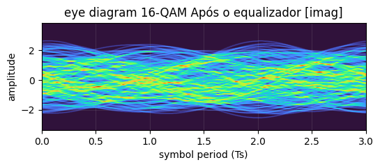

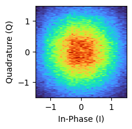

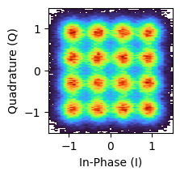

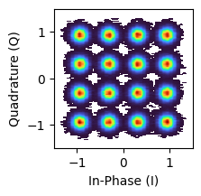

### Desempenho BER vs SNR com e sem equalizador 

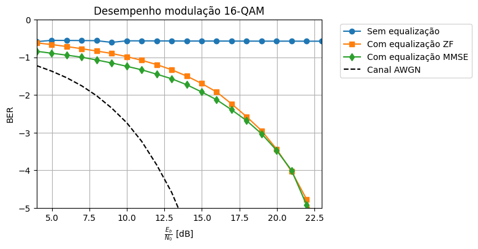
